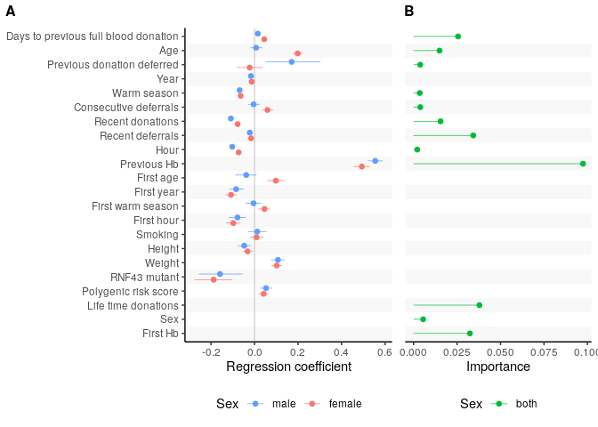
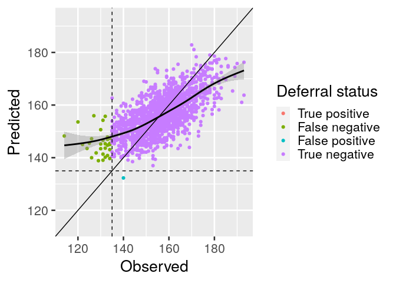
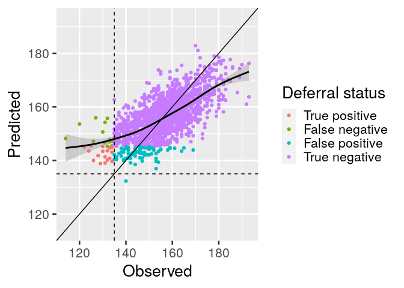

Effect sizes and importances of variables
-----------------------------------------

Effect sizes of variables from eProgesa and Biobank using dynamic linear
mixed model. In addition, variables importance from random forest
algorithm.

    if (save_figs) {
        filename <- paste(fig_path, "effect_size_importance.pdf", sep="/")
    } else {
        filename <- NULL
    }
    create_forest_importance_plot(male_posterior, female_posterior, variables, filename=filename)

    ## Warning: Removed 3 rows containing missing values (geom_pointrangeh).

    ## Warning: Removed 10 rows containing missing values (geom_pointrangeh).

Alternative effect sizes and importances of variables
-----------------------------------------------------

    res <- alternative_create_forest_importance_plot(male_posterior, female_posterior, variables, filename=filename)

    ## # A tibble: 22 x 2
    ##    Pretty                               stripe
    ##    <fct>                                <fct> 
    ##  1 Days to previous full blood donation 1     
    ##  2 Age                                  0     
    ##  3 Previous donation deferred           1     
    ##  4 Year                                 0     
    ##  5 Warm season                          1     
    ##  6 Consecutive deferrals                0     
    ##  7 Recent donations                     1     
    ##  8 Recent deferrals                     0     
    ##  9 Hour                                 1     
    ## 10 Previous Hb                          0     
    ## # … with 12 more rows

    g <- res$plot
    final <- res$final
    if (save_figs)
      ggsave(filename="alternative_effect_size_importance.pdf", title="Performance forest plot", path=fig_path, plot=g, dpi=600, units="mm", width=180)
    g

    ## Warning: Removed 13 rows containing missing values (geom_pointrangeh).

Performance forest plot
-----------------------

    res <- create_performance_forest_plot()

    ## Parsed with column specification:
    ## cols(
    ##   Id = col_character(),
    ##   type = col_character(),
    ##   value = col_double(),
    ##   low = col_double(),
    ##   high = col_double()
    ## )
    ## Parsed with column specification:
    ## cols(
    ##   Id = col_character(),
    ##   type = col_character(),
    ##   value = col_double(),
    ##   low = col_double(),
    ##   high = col_double()
    ## )

    ## # A tibble: 4 x 5
    ##   Id                  value    low   high type                              
    ##   <chr>               <dbl>  <dbl>  <dbl> <fct>                             
    ## 1 progesa-female-lmm -1.23  -1.23  -1.23  Economic effect: 6 month deferral 
    ## 2 progesa-female-lmm  0.335  0.335  0.335 Economic effect: 6 month deferral 
    ## 3 progesa-female-lmm -1.23  -1.23  -1.23  Economic effect: 12 month deferral
    ## 4 progesa-female-lmm  0.335  0.335  0.335 Economic effect: 12 month deferral
    ## # A tibble: 84 x 7
    ##    Id                   type  value   low  high sex    model
    ##    <fct>                <fct> <dbl> <dbl> <dbl> <fct>  <fct>
    ##  1 progesa-female-lmm   AUROC 0.804  0.79  0.81 female lmm  
    ##  2 progesa-female-dlmm  AUROC 0.815  0.81  0.82 female dlmm 
    ##  3 progesa-male-lmm     AUROC 0.852  0.84  0.87 male   lmm  
    ##  4 progesa-male-dlmm    AUROC 0.865  0.85  0.88 male   dlmm 
    ##  5 finngen-male-dlmm    AUROC 0.895  0.84  0.95 male   dlmm 
    ##  6 finngen-female-dlmm  AUROC 0.802  0.76  0.85 female dlmm 
    ##  7 findonor-female-dlmm AUROC 0.818  0.76  0.87 female dlmm 
    ##  8 findonor-male-dlmm   AUROC 0.764  0.65  0.88 male   dlmm 
    ##  9 progesa-both-dt      AUROC 0.78   0.77  0.79 both   dt   
    ## 10 progesa-both-rf      AUROC 0.86   0.85  0.86 both   rf   
    ## # … with 74 more rows

    g <- res$g
    df <- res$df
    if (save_figs)
      ggsave(filename="performance_forest_plot.pdf", title="Performance forest plot", path=fig_path, plot=g, dpi=600, units="mm", width=180)
    g

    ## Warning: Removed 1 rows containing missing values (geom_pointrangeh).

Calibration plots
-----------------

    g <- calibration_plots(ids)

    ## `summarise()` regrouping output by 'Id' (override with `.groups` argument)

    if (save_figs)
      ggsave(filename="calibration_plots.pdf", title="Calibration plots", path=fig_path, plot=g, dpi=600, units="mm", width=180)
    g

    ## Warning: Transformation introduced infinite values in discrete y-axis

    ## Warning: Removed 26 rows containing missing values (geom_point).

    ## Warning: Removed 26 rows containing missing values (geom_text).

Classification scatter plot for male Finngen DLMM
-------------------------------------------------

    g1 <- create_classification_scatter_plot(finngenn_male_raw$comp_df, 135, NULL)
    g2 <- create_classification_scatter_plot(finngenn_male_raw$comp_df, 135, 0.1)
    if (save_figs) {
      ggsave(filename="classification-scatter-plot-hb-finngen-male-dlmm.pdf", title="Classifiction scatter plot finngen-male-dlmm", path=fig_path, 
             plot=g1, dpi=600, units="mm", width=180)
      ggsave(filename="classification-scatter-plot-probability-finngen-male-dlmm.pdf", title="Classifiction scatter plot finngen-male-dlmm", path=fig_path, 
             plot=g2, dpi=600, units="mm", width=180)
    }
    g1

    ## `geom_smooth()` using method = 'gam' and formula 'y ~ s(x, bs = "cs")'

    g2

    ## `geom_smooth()` using method = 'gam' and formula 'y ~ s(x, bs = "cs")'

Testing the effect of base\_size parameter.

    g1 + theme_gray(base_size=20)

    ## `geom_smooth()` using method = 'gam' and formula 'y ~ s(x, bs = "cs")'

    g2 + theme_gray(base_size=20)

    ## `geom_smooth()` using method = 'gam' and formula 'y ~ s(x, bs = "cs")'

