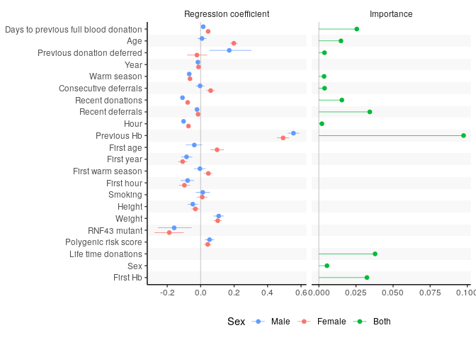
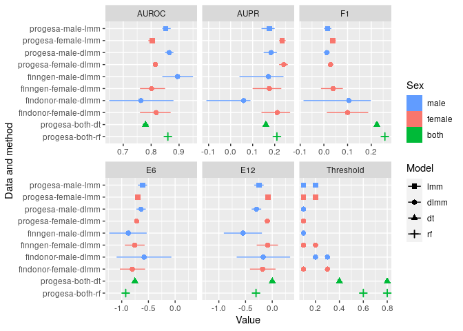
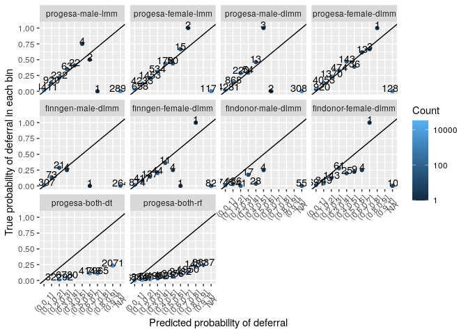
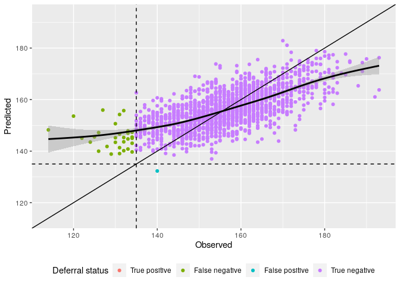
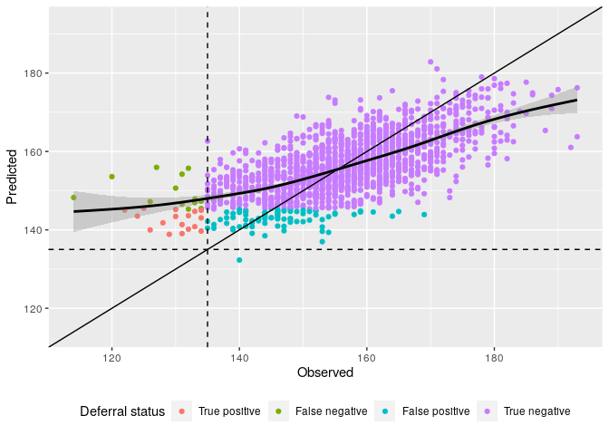

Effect sizes and importances of variables
-----------------------------------------

Effect sizes of variables from eProgesa and Biobank using dynamic linear
mixed model. In addition, variables importance from random forest
algorithm.

    if (save_figs) {
        filename <- paste(fig_path, "old-effect-size-importance.pdf", sep="/")
    } else {
        filename <- NULL
    }
    create_forest_importance_plot(male_posterior, female_posterior, variables, filename=filename)

Alternative effect sizes and importances of variables
-----------------------------------------------------

    res <- alternative_create_forest_importance_plot(male_posterior, female_posterior, variables, filename=filename)
    g <- res$plot
    final <- res$final
    if (save_figs)
      ggsave(filename="effect-size-importance.pdf", title="Effect sizes and importances", path=fig_path, plot=g, dpi=600, units="mm", width=180)

    ## Saving 180 x 127 mm image

    ## Warning: Removed 13 rows containing missing values (geom_pointrangeh).

      ggsave(filename="presentation-effect-size-importance.pdf", title="Effect sizes and importances", path=fig_path, plot=g, dpi=600, units="mm", width=180, height=90)

    ## Warning: Removed 13 rows containing missing values (geom_pointrangeh).

    g

    ## Warning: Removed 13 rows containing missing values (geom_pointrangeh).

Performance forest plot
-----------------------

    res <- create_performance_forest_plot()

    ## Parsed with column specification:
    ## cols(
    ##   Id = col_character(),
    ##   variable = col_character(),
    ##   type = col_character(),
    ##   value = col_double()
    ## )

    g <- res$g
    df <- res$df
    if (save_figs)
      ggsave(filename="performance-forest-plot.pdf", #  title="Performance forest plot", 
             path=fig_path, plot=g, dpi=600, units="mm", width=180, device=cairo_pdf)

    ## Saving 180 x 127 mm image

    ## Warning: Removed 1 rows containing missing values (geom_pointrangeh).

    g

    ## Warning: Removed 1 rows containing missing values (geom_pointrangeh).

Calibration plots
-----------------

    g <- calibration_plots(ids)

    ## `summarise()` regrouping output by 'Id' (override with `.groups` argument)

    if (save_figs)
      ggsave(filename="calibration_plots.pdf", title="Calibration plots", path=fig_path, plot=g, dpi=600, units="mm", width=180)

    ## Saving 180 x 127 mm image

    ## Warning: Transformation introduced infinite values in discrete y-axis

    ## Warning: Removed 26 rows containing missing values (geom_point).

    ## Warning: Removed 26 rows containing missing values (geom_text).

    g

    ## Warning: Transformation introduced infinite values in discrete y-axis

    ## Warning: Removed 26 rows containing missing values (geom_point).

    ## Warning: Removed 26 rows containing missing values (geom_text).

Classification scatter plot for male Finngen DLMM
-------------------------------------------------

    g1 <- create_classification_scatter_plot(finngenn_male_raw$comp_df, 135, NULL)
    g2 <- create_classification_scatter_plot(finngenn_male_raw$comp_df, 135, 0.1)
    if (save_figs) {
      ggsave(filename="classification-scatter-plot-hb-finngen-male-dlmm.pdf", title="Classifiction scatter plot finngen-male-dlmm", path=fig_path, 
             plot=g1, dpi=600, units="mm", width=180)
      ggsave(filename="classification-scatter-plot-probability-finngen-male-dlmm.pdf", title="Classifiction scatter plot finngen-male-dlmm", path=fig_path, 
             plot=g2, dpi=600, units="mm", width=180)
    }

    ## Saving 180 x 127 mm image

    ## `geom_smooth()` using method = 'gam' and formula 'y ~ s(x, bs = "cs")'

    ## Saving 180 x 127 mm image

    ## `geom_smooth()` using method = 'gam' and formula 'y ~ s(x, bs = "cs")'

    g1

    ## `geom_smooth()` using method = 'gam' and formula 'y ~ s(x, bs = "cs")'

    g2

    ## `geom_smooth()` using method = 'gam' and formula 'y ~ s(x, bs = "cs")'

Testing the effect of base\_size parameter.

    base_size <- 20
    presentation1 <- g1 + coord_fixed() + theme_gray(base_size=base_size)
    presentation2 <- g2 + coord_fixed() + theme_gray(base_size=base_size)
    if (save_figs) {
      ggsave(filename="presentation-classification-scatter-plot-hb-finngen-male-dlmm.pdf", title="Classifiction scatter plot finngen-male-dlmm", path=fig_path, 
             plot=presentation1, dpi=600, units="mm", width=180, height=120)
      ggsave(filename="presentation-classification-scatter-plot-probability-finngen-male-dlmm.pdf", title="Classifiction scatter plot finngen-male-dlmm", path=fig_path, 
             plot=presentation2, dpi=600, units="mm", width=180, height=120)
    }

    ## `geom_smooth()` using method = 'gam' and formula 'y ~ s(x, bs = "cs")'
    ## `geom_smooth()` using method = 'gam' and formula 'y ~ s(x, bs = "cs")'

Pretty print results as a table.

    df <- read_csv("~/FRCBS/results-for-eba-paper/raw-data-2020-12-01.csv")

    ## Parsed with column specification:
    ## cols(
    ##   Id = col_character(),
    ##   variable = col_character(),
    ##   type = col_character(),
    ##   value = col_double()
    ## )

    df <- df %>% 
      pivot_wider(names_from=c("variable", "type"), values_from=value, names_glue="{variable} {type}")
    names(df) <- str_remove(names(df), " value$")
    df2 <- df %>%
      select("Id", "F1", "F1 low", "F1 high", "threshold6", "threshold12", "E6", "E6 low", "E6 high", "E12", "E12 low", "E12 high")
    kable(df2, digits=2)

<table>
<thead>
<tr class="header">
<th style="text-align: left;">Id</th>
<th style="text-align: right;">F1</th>
<th style="text-align: right;">F1 low</th>
<th style="text-align: right;">F1 high</th>
<th style="text-align: right;">threshold6</th>
<th style="text-align: right;">threshold12</th>
<th style="text-align: right;">E6</th>
<th style="text-align: right;">E6 low</th>
<th style="text-align: right;">E6 high</th>
<th style="text-align: right;">E12</th>
<th style="text-align: right;">E12 low</th>
<th style="text-align: right;">E12 high</th>
</tr>
</thead>
<tbody>
<tr class="odd">
<td style="text-align: left;">progesa-male-lmm</td>
<td style="text-align: right;">0.02</td>
<td style="text-align: right;">0.00</td>
<td style="text-align: right;">0.03</td>
<td style="text-align: right;">0.04</td>
<td style="text-align: right;">0.08</td>
<td style="text-align: right;">-0.93</td>
<td style="text-align: right;">-1.01</td>
<td style="text-align: right;">-0.85</td>
<td style="text-align: right;">-0.27</td>
<td style="text-align: right;">-0.36</td>
<td style="text-align: right;">-0.18</td>
</tr>
<tr class="even">
<td style="text-align: left;">progesa-female-lmm</td>
<td style="text-align: right;">0.04</td>
<td style="text-align: right;">0.03</td>
<td style="text-align: right;">0.05</td>
<td style="text-align: right;">0.08</td>
<td style="text-align: right;">0.20</td>
<td style="text-align: right;">-0.71</td>
<td style="text-align: right;">-0.75</td>
<td style="text-align: right;">-0.66</td>
<td style="text-align: right;">-0.08</td>
<td style="text-align: right;">-0.12</td>
<td style="text-align: right;">-0.03</td>
</tr>
<tr class="odd">
<td style="text-align: left;">progesa-male-dlmm</td>
<td style="text-align: right;">0.01</td>
<td style="text-align: right;">0.00</td>
<td style="text-align: right;">0.02</td>
<td style="text-align: right;">0.02</td>
<td style="text-align: right;">0.06</td>
<td style="text-align: right;">-0.95</td>
<td style="text-align: right;">-1.02</td>
<td style="text-align: right;">-0.88</td>
<td style="text-align: right;">-0.30</td>
<td style="text-align: right;">-0.39</td>
<td style="text-align: right;">-0.21</td>
</tr>
<tr class="even">
<td style="text-align: left;">progesa-female-dlmm</td>
<td style="text-align: right;">0.03</td>
<td style="text-align: right;">0.02</td>
<td style="text-align: right;">0.04</td>
<td style="text-align: right;">0.08</td>
<td style="text-align: right;">0.20</td>
<td style="text-align: right;">-0.75</td>
<td style="text-align: right;">-0.79</td>
<td style="text-align: right;">-0.70</td>
<td style="text-align: right;">-0.09</td>
<td style="text-align: right;">-0.14</td>
<td style="text-align: right;">-0.05</td>
</tr>
<tr class="odd">
<td style="text-align: left;">finngen-male-dlmm</td>
<td style="text-align: right;">NaN</td>
<td style="text-align: right;">NaN</td>
<td style="text-align: right;">NaN</td>
<td style="text-align: right;">0.04</td>
<td style="text-align: right;">0.08</td>
<td style="text-align: right;">-1.16</td>
<td style="text-align: right;">-1.42</td>
<td style="text-align: right;">-0.90</td>
<td style="text-align: right;">-0.58</td>
<td style="text-align: right;">-0.92</td>
<td style="text-align: right;">-0.23</td>
</tr>
<tr class="even">
<td style="text-align: left;">finngen-female-dlmm</td>
<td style="text-align: right;">0.04</td>
<td style="text-align: right;">-0.01</td>
<td style="text-align: right;">0.08</td>
<td style="text-align: right;">0.12</td>
<td style="text-align: right;">0.24</td>
<td style="text-align: right;">-0.76</td>
<td style="text-align: right;">-0.95</td>
<td style="text-align: right;">-0.57</td>
<td style="text-align: right;">-0.17</td>
<td style="text-align: right;">-0.36</td>
<td style="text-align: right;">0.01</td>
</tr>
<tr class="odd">
<td style="text-align: left;">findonor-male-dlmm</td>
<td style="text-align: right;">0.11</td>
<td style="text-align: right;">-0.09</td>
<td style="text-align: right;">0.19</td>
<td style="text-align: right;">0.14</td>
<td style="text-align: right;">0.30</td>
<td style="text-align: right;">-0.62</td>
<td style="text-align: right;">-1.13</td>
<td style="text-align: right;">-0.11</td>
<td style="text-align: right;">-0.17</td>
<td style="text-align: right;">-0.65</td>
<td style="text-align: right;">0.33</td>
</tr>
<tr class="even">
<td style="text-align: left;">findonor-female-dlmm</td>
<td style="text-align: right;">0.10</td>
<td style="text-align: right;">0.01</td>
<td style="text-align: right;">0.19</td>
<td style="text-align: right;">0.18</td>
<td style="text-align: right;">0.28</td>
<td style="text-align: right;">-0.85</td>
<td style="text-align: right;">-1.07</td>
<td style="text-align: right;">-0.63</td>
<td style="text-align: right;">-0.21</td>
<td style="text-align: right;">-0.47</td>
<td style="text-align: right;">0.04</td>
</tr>
<tr class="odd">
<td style="text-align: left;">progesa-both-dt</td>
<td style="text-align: right;">0.22</td>
<td style="text-align: right;">0.21</td>
<td style="text-align: right;">0.23</td>
<td style="text-align: right;">0.40</td>
<td style="text-align: right;">0.76</td>
<td style="text-align: right;">-0.76</td>
<td style="text-align: right;">-0.79</td>
<td style="text-align: right;">-0.72</td>
<td style="text-align: right;">0.03</td>
<td style="text-align: right;">0.00</td>
<td style="text-align: right;">0.06</td>
</tr>
<tr class="even">
<td style="text-align: left;">progesa-both-rf</td>
<td style="text-align: right;">0.25</td>
<td style="text-align: right;">0.24</td>
<td style="text-align: right;">0.26</td>
<td style="text-align: right;">0.48</td>
<td style="text-align: right;">0.76</td>
<td style="text-align: right;">-0.92</td>
<td style="text-align: right;">-0.96</td>
<td style="text-align: right;">-0.89</td>
<td style="text-align: right;">-0.28</td>
<td style="text-align: right;">-0.32</td>
<td style="text-align: right;">-0.24</td>
</tr>
<tr class="odd">
<td style="text-align: left;">progesa-male-dummy</td>
<td style="text-align: right;">0.16</td>
<td style="text-align: right;">0.14</td>
<td style="text-align: right;">0.17</td>
<td style="text-align: right;">0.36</td>
<td style="text-align: right;">0.58</td>
<td style="text-align: right;">-0.84</td>
<td style="text-align: right;">-0.93</td>
<td style="text-align: right;">-0.75</td>
<td style="text-align: right;">-0.19</td>
<td style="text-align: right;">-0.29</td>
<td style="text-align: right;">-0.10</td>
</tr>
<tr class="even">
<td style="text-align: left;">progesa-female-dummy</td>
<td style="text-align: right;">0.20</td>
<td style="text-align: right;">0.19</td>
<td style="text-align: right;">0.20</td>
<td style="text-align: right;">0.64</td>
<td style="text-align: right;">0.90</td>
<td style="text-align: right;">-0.60</td>
<td style="text-align: right;">-0.64</td>
<td style="text-align: right;">-0.56</td>
<td style="text-align: right;">0.12</td>
<td style="text-align: right;">0.09</td>
<td style="text-align: right;">0.16</td>
</tr>
</tbody>
</table>
