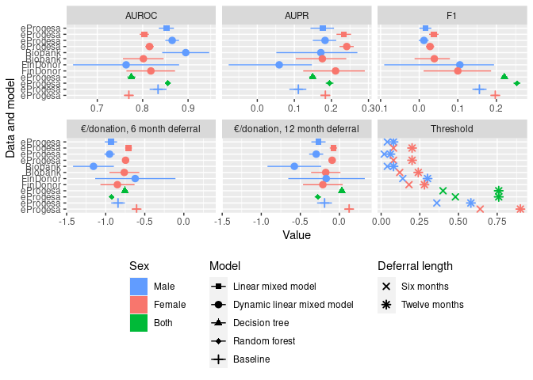

    descript <- tibble(Variable = c("donor", "Hb", "days_to_previous_fb", "age", "previous_Hb_def", 
                                    "year", "warm_season", "consecutive_deferrals", "recent_donations",
                                    "recent_deferrals", "hour", 
                                    "previous_Hb", "Hb_first", "Hb_deferral","nb_donat","gender"), 
                       Pretty = c("Donor ID", "Hemoglobin", "Days to previous full blood donation", "Age", 
                                  "Previous donation deferred", #"Previous Hb deferral",   # This is a more descriptive name
                                  "Year", "Warm season", "Consecutive deferrals", "Recent donations", 
                                  "Recent deferrals", "Hour", 
                                  "Previous Hb", "First Hb", "Hb deferral","Life time donations","Sex"),
                       Type = c("Factor", "numeric", "numeric (int)", "numeric", "boolean",
                                "numeric (int)", "boolean", "numeric (int)", "numeric (int)", "numeric (int)", "numeric",
                                "numeric", "numeric", "boolean","numeric (int)","Factor"),
                       Explanation = c("Donor identifier",
                                       "Amount of Hemoglobin",
                                       "Time (in days) between Hb measurement and previous full blood donation event",
                                       "Age of donor",
                                       "Indicates whether the donor was deferred from blood donation due to low hemoglobin at previous donation event",
                                       "Year of donation",
                                       "True if donation was given in April-September",
                                       "Amount of times the donor has been deferred due to low hemoglobin since last succesful whole blood donation",
                                       "Amount of donations in the last two years",
                                       "Amount of deferrals due to low hemoglobin in the last two years",
                                       "Time of day when donation was given as hours (e.g. 13:45 = 13.75)",
                                       "Hb value at previous measurement (ICP-model)",
                                       "Hb value at first donation of this donor (Non ICP-model)",
                                       "Deferred based on low hemoglogin",
                                      "Life time total count of donations",
                                      "Sex"
                       )
                       )

Effect sizes and importances of variables
-----------------------------------------

Effect sizes of variables from eProgesa and Biobank using dynamic linear
mixed model. In addition, variables importance from random forest
algorithm.

    # create_variable_importance_plot <- function(rrfFit_roc, descript, base_size = 11) {
    #   rrfFit_rocImp <- varImp(rrfFit_roc, scale = FALSE)
    #   rrfFit.varimp <- as_tibble(cbind(rownames(rrfFit_rocImp$importance),rrfFit_rocImp$importance))
    #   colnames(rrfFit.varimp) <- c("Variable","Importance")
    #   rrfFit.varimp <- left_join(rrfFit.varimp, descript, by=c("Variable"="Variable")) %>% select(Variable,Pretty,Importance) %>% arrange(Importance)
    #   
    #   rrfFit.varimp$Pretty[rrfFit.varimp$Variable == "previous_Hb_defTRUE"] <- "Previous donation deferred"
    #   rrfFit.varimp$Pretty[rrfFit.varimp$Variable == "warm_seasonTRUE"] <- "Warm season"
    #   rrfFit.varimp$Pretty[rrfFit.varimp$Variable == "genderWomen"] <- "Sex"
    #   
    #   varimp.plot <- ggplot(rrfFit.varimp) + 
    #     geom_col(aes(y=Importance, x=reorder(Pretty, Importance)), alpha=0.7) + 
    #     coord_flip() +
    #     xlab(NULL) + 
    #     theme_gray(base_size = base_size)
    #     #xlab("Variable")
    #   
    #   #filename="../results/rrfFit_roc_importance.pdf"
    #   #ggsave(filename=filename, varimp.plot, width = 180,  height = 80,units="mm", dpi=600, scale=1.0)
    #   return(varimp.plot)
    # }

    # Creates a forest plot of means and confidence intervals from posterior distributions.
    # Puts both male and female results in the same plot.
    create_double_forest_plot <- function(male_posterior, female_posterior, variables, combined_variables, base_size = 11) {
      for (gender in c("male", "female")) {
        #posterior <- ifelse(gender == "male", male_posterior, female_posterior)
        if (gender == "male") {
          posterior <- male_posterior
        } else {
          posterior <- female_posterior
        }
        
        for (i in seq_along(posterior)) {
          #cat(sprintf("Gender %s, Column %i\n", gender, i))
          v <- posterior[[i]]
          ci_hdi <- bayestestR::ci(v, method = "HDI", ci=0.95)
          #str(ci_hdi)
          L <- list(names = variables[[i]], gender=gender, mean = mean(v), low = ci_hdi$CI_low, high = ci_hdi$CI_high)
          if (i == 1 && gender=="male") {
            result <- data.frame(L, stringsAsFactors = FALSE)
          } else {
            result <- rbind(result, L)
          }
        }
      }
      result <- as_tibble(result)
      result <- result %>%
        mutate(gender = factor(gender, levels=c("female", "both", "male"))) %>%
        rename(Pretty=names) %>%
        mutate(Pretty=factor(Pretty, levels=levels(combined_variables$Pretty)))
      cis <- result
      #result <- DescTools::Rev(result, margin=1)   # Reverse the order of rows so they appear in correct order in the forest plot
      print(head(result))
      #combined_variables <- combined_variables %>% 
        #rename(names=Pretty) %>%
        #mutate(stripe=factor(row_number()%%2))
      result <- left_join(combined_variables, result, by="Pretty") %>%
        mutate(Pretty=fct_rev(Pretty))
      
        #mutate(Pretty=factor(Pretty, levels=rev(combined_variables$Pretty)))
        # group_by(gender) %>%
        # mutate(stripe=factor(row_number()%%2)) %>%
        # ungroup()
      df1 <<- result
      plot <- result %>% 
        # mutate(Pretty=factor(names, levels=rev(combined_variables$names)), 
        #        stripe=factor(row_number()%%2)) %>%
        ggplot() +     
        geom_vline(aes(xintercept=0), color="lightgray") +
        #geom_pointrange() +
        ggstance::geom_pointrangeh(aes(y=Pretty, x=mean, xmin=low, xmax=high, color=gender),
                                   position=position_dodge2(width=0.8, padding=0.1), size=0.25) + # ggstance is required to make legend keys horizontal
        geom_rect(data=combined_variables %>% filter(stripe==1), 
                  mapping=aes(ymax = as.numeric(Pretty) + 0.5,
                      ymin = as.numeric(Pretty) - 0.5),
                      #xmin = -Inf,
                      #xmax = Inf,
                      fill = "gray", xmin=-Inf, xmax=Inf, alpha = 0.1, show.legend = FALSE, colour=NA) +
        labs(title="", #title="Effects sizes of variables on Hb prediction",
             x="Regression coefficient", y=NULL, colour="Sex") +
        scale_colour_discrete(drop=FALSE, breaks = c("male", "female")) + 
        #guides(colour = guide_legend(reverse = TRUE)) + # Reverse the order of keys in the legend
        #theme_gray(base_size = base_size) + theme(legend.position = "bottom", legend.direction = "horizontal")
        theme_classic(base_size = base_size) + theme(legend.position = "bottom", legend.direction = "horizontal")
      return(list(plot=plot, cis=cis))
    }

    create_variable_importance_plot2 <- function(rrfFit_roc, descript, combined_variables, base_size = 11) {
      rrfFit_rocImp <- varImp(rrfFit_roc, scale = FALSE)
      rrfFit.varimp <- as_tibble(cbind(rownames(rrfFit_rocImp$importance),rrfFit_rocImp$importance))
      colnames(rrfFit.varimp) <- c("Variable","Importance")
      rrfFit.varimp <- left_join(rrfFit.varimp, descript, by=c("Variable"="Variable")) %>% select(Variable,Pretty,Importance) %>% arrange(Importance)
      
      rrfFit.varimp$Pretty[rrfFit.varimp$Variable == "previous_Hb_defTRUE"] <- "Previous donation deferred"
      rrfFit.varimp$Pretty[rrfFit.varimp$Variable == "warm_seasonTRUE"] <- "Warm season"
      rrfFit.varimp$Pretty[rrfFit.varimp$Variable == "genderWomen"] <- "Sex"
      
      #pretty <- descript["Pretty"]
      #pretty <- combined_variables
      rrfFit.varimp <- rrfFit.varimp %>% mutate(Pretty=factor(Pretty, levels=levels(combined_variables$Pretty)))
      rrfFit.varimp <- left_join(combined_variables, rrfFit.varimp, by="Pretty")

      var_imp <- rrfFit.varimp %>%
          mutate(Pretty=fct_rev(Pretty),
                 gender=factor("both", levels=c("female", "both", "male"))) 
                 #stripe=factor(row_number()%%2))
      print(var_imp) 
      df2 <<- var_imp
      varimp.plot <- var_imp %>% 
          # rrfFit.varimp %>%
          # mutate(Pretty=factor(Pretty, levels=rev(Pretty)), 
          #        stripe=factor(row_number()%%2)) %>%
        ggplot() + 
        ggstance::geom_pointrangeh(aes(y=Pretty, x=Importance, xmin=0, xmax=Importance, colour = gender), # ggstance is required to make legend keys horizontal
                                   position=position_dodge2(width=0.8, padding=0.1), size=0.25, inherit.aes = FALSE) +   
                                   #colour = hue_pal()(3)[2], size=0.25) +
          geom_rect(data=combined_variables %>% filter(stripe==1),
                  mapping=aes(ymax = as.numeric(Pretty) + 0.5,
                        ymin = as.numeric(Pretty) - 0.5),
                        #xmin = -Inf,
                        #xmax = Inf,
                        #fill = stripe), 
                  xmin=-Inf, xmax=Inf, alpha = 0.1, colour=NA, fill="gray", show.legend = FALSE, inherit.aes = FALSE) +
        labs(y=NULL, colour="Sex") + 
        guides(y="none") +
        scale_colour_discrete(drop=FALSE, breaks=c("both")) +
        #theme_gray(base_size = base_size)
        theme_classic(base_size = base_size) + theme(legend.position = "bottom", legend.direction = "horizontal")

      return(varimp.plot)
    }

      
    create_forest_importance_plot <- function(male_posterior, female_posterior, variables,
                                               filename=NULL,
                                               width = 180,  # width of the combined figure in millimetres
                                              base_size = 11
    ) {
      rrfFit_roc <- load_single("~/FRCBS/interval_prediction/results/rrfFit_roc.rdata")
      combined_variables <- tibble(Pretty=c(variables, "Life time donations", "Sex", "First Hb")) %>%
        mutate(stripe=factor(row_number()%%2),
               Pretty=factor(Pretty, levels=Pretty))
      combined_variables <<- combined_variables
      forest <- create_double_forest_plot(male_posterior, female_posterior, variables, combined_variables, base_size = base_size)$plot
      importance <- create_variable_importance_plot2(rrfFit_roc, descript, combined_variables, base_size = base_size)
      
      use_cowplot <- TRUE
      
      if (use_cowplot) {
        forest_importance <- cowplot::plot_grid(forest, importance, labels = c('A', 'B'), label_size = 12, nrow=1, scale=1.0, axis="tb", align="h",
                                                rel_widths = c(2, 1))
        if (!is.null(filename)) {
          cowplot::save_plot(filename, forest_importance, title="Effect sizes and importances",
                             ncol = 2, base_asp = 1.0, base_width = width / 25.4 / 2, base_height = NULL)
        }
      } else {
        forest_importance <- gridExtra::grid.arrange(forest, importance, nrow = 1, respect=TRUE)   # Combine the plots
        if (!is.null(filename)) {
          ggsave(filename=filename, forest_importance, width = width, units="mm", dpi=600, scale=1.0)
        }
      }
      forest_importance
    }

    finngenn_male_raw <- get_raw_result_list("finngen-male-dlmm")
    finngenn_female_raw <- get_raw_result_list("finngen-female-dlmm")
    male_posterior <- finngenn_male_raw$samples
    female_posterior <- finngenn_female_raw$samples
    variables <- finngenn_male_raw$pretty_variable_names
    # Give a more descriptive name to this variable
    variables <- replace(variables, variables=="Previous Hb deferral", "Previous donation deferred") #"Previous donation deferred", #"Previous Hb deferral"

    if (save_figs) {
        filename <- paste(fig_path, "effect_size_importance.pdf", sep="/")
    } else {
        filename <- NULL
    }
    create_forest_importance_plot(male_posterior, female_posterior, variables, filename=filename)

    ## # A tibble: 6 x 5
    ##   Pretty                               gender     mean      low     high
    ##   <fct>                                <fct>     <dbl>    <dbl>    <dbl>
    ## 1 Days to previous full blood donation male    0.0152   0.00691  0.0241 
    ## 2 Age                                  male    0.00742 -0.0190   0.0349 
    ## 3 Previous donation deferred           male    0.171    0.0523   0.303  
    ## 4 Year                                 male   -0.0166  -0.0299  -0.00366
    ## 5 Warm season                          male   -0.0684  -0.0758  -0.0611 
    ## 6 Consecutive deferrals                male   -0.00380 -0.0303   0.0232 
    ## # A tibble: 22 x 5
    ##    Pretty                           stripe Variable            Importance gender
    ##    <fct>                            <fct>  <chr>                    <dbl> <fct> 
    ##  1 Days to previous full blood don… 1      days_to_previous_fb    0.0256  both  
    ##  2 Age                              0      age                    0.0149  both  
    ##  3 Previous donation deferred       1      previous_Hb_defTRUE    0.00380 both  
    ##  4 Year                             0      <NA>                  NA       both  
    ##  5 Warm season                      1      warm_seasonTRUE        0.00353 both  
    ##  6 Consecutive deferrals            0      consecutive_deferr…    0.00385 both  
    ##  7 Recent donations                 1      recent_donations       0.0155  both  
    ##  8 Recent deferrals                 0      recent_deferrals       0.0343  both  
    ##  9 Hour                             1      hour                   0.00206 both  
    ## 10 Previous Hb                      0      previous_Hb            0.0975  both  
    ## # … with 12 more rows

    ## Warning: Removed 3 rows containing missing values (geom_pointrangeh).

    ## Warning: Removed 10 rows containing missing values (geom_pointrangeh).

Performance forest plot
-----------------------

    # Show AUROC, AUPR, F1, E6, and E12 as forest plot
    create_performance_forest_plot <- function() {
      df <- read_csv("~/FRCBS/results-for-eba-paper/raw_data.csv")
      df <- df %>%
        mutate(Id=factor(Id, levels=rev(ids)),
               type=factor(type, levels=c("AUROC", "AUPR", "F1", "E6", "E12")),
               sex=factor(str_split_fixed(Id, "-", 3)[,2], levels=c("female", "both", "male")),
               model=factor(str_split_fixed(Id, "-", 3)[,3]))
      
      # Below we use a dummy table and geom_blank to have the same xlimits for E6 and E12 panels
      xrange <- as.numeric(df %>% filter(type %in% c("E6", "E12")) %>% summarise(low=min(low), high=max(high))) # range of x-axis for E6 and E12
      xrange <- rep(xrange, 2)
      mytype <- factor(rep(c("E6", "E12"), each=2), levels=c("AUROC", "AUPR", "F1", "E6", "E12"))
      dummy <- tibble(Id="progesa-female-lmm", value=xrange, low=xrange, high=xrange, type=mytype)  # Dummy table to use the same x-axis limits for E6 and E12
      #print(dummy)
      
      #key_size <- as.numeric(grid::convertX(theme_get()$legend.key.size, "mm"))
      key_size <- 1.8
      #key_size <- unit(1.2, "lines")
      g <- df %>% ggplot(aes(y=Id, x=value, xmin=low, xmax=high)) + 
        ggstance::geom_pointrangeh(aes(colour=sex, shape=model)) + 
        #geom_pointrange(aes(colour=sex, fill=sex, shape=model), key_glyph = draw_key_rect) + 
        labs(x="Value", y="Data and method", colour="Sex", shape="Model") + 
        #scale_colour_manual(breaks = c("male", "female", "both"), values=c("yellow", "brown", "black"), aesthetics = c("color", "fill", "shape")) +
        scale_colour_discrete(breaks = c("male", "female", "both")) +
        scale_shape_discrete(breaks=c("lmm", "dlmm", "dt", "rf")) +
        #scale_colour_manual(values = c("female" = 1, "male" = 2, "both" = 3)) +
        guides(colour = guide_legend(override.aes = list(shape = 15, linetype=0, size=key_size))) +
        geom_blank(data=dummy) +
        facet_wrap("type", scales="free_x")
      #ggsave(filename="~/FRCBS/results-for-eba-paper/forest_plot.pdf", plot=g, dpi=600, units="mm", width=180)
      return(g)
    }

    g <- create_performance_forest_plot()

    ## Parsed with column specification:
    ## cols(
    ##   Id = col_character(),
    ##   type = col_character(),
    ##   value = col_double(),
    ##   low = col_double(),
    ##   high = col_double()
    ## )

    if (save_figs)
      ggsave(filename="performance_forest_plot.pdf", title="Performance forest plot", path=fig_path, plot=g, dpi=600, units="mm", width=180)
    g

    ## Warning: Removed 1 rows containing missing values (geom_pointrangeh).

\#\# Calibration plots

    calibration_plot <- function(df, use_my_method=FALSE) {
      if (use_my_method) {
        df$cat <- cut(df$Deferred, seq(0.0, 1.0, length.out = 11))
        df2 <- df %>% group_by(cat, .drop=FALSE) %>% summarise(true_bin_prob = mean(obs=="Deferred"))
        df2 %>% ggplot(aes(cat, true_bin_prob)) + geom_point() + ylim(0, 1)
      } else {
        cal <- calibration(obs ~ Deferred, data=df, class="Deferred", cuts=11)
        ggplot(cal) + ylim(0, 100)
      }
    }

    calibration_plots <- function(ids) {
      data_frames <- map(ids, get_data_frame)
      names(data_frames) <- ids
      df <- bind_rows(data_frames, .id="Id")
      df <- df %>% 
        group_by(Id) %>%
        mutate(cat=cut(Deferred, seq(0.0, 1.0, length.out = 11))) %>%
        group_by(Id, cat, .drop=FALSE) %>% summarise(true_bin_prob = mean(obs=="Deferred"), count=n()) %>%
        ungroup() %>%
        mutate(Id = factor(Id, levels=ids))
      
      g <- df %>% ggplot(aes(cat, true_bin_prob, colour=count)) + 
        geom_point() + 
        geom_text(aes(label=count), colour="black", nudge_y=0.05) +
        ylim(0, 1.05) +
        labs(x="Predicted probability of deferral", y="True probability of deferral in each bin") +
        scale_colour_gradient(name = "Count", trans = "log10") +
        geom_abline(aes(intercept=-0.1, slope=0.1)) +
        facet_wrap("Id") +
        theme(axis.text.x = element_text(angle = 45, vjust = 0.5))
      
      #return(df)
      return(g)
    }

    g <- calibration_plots(ids)

    ## `summarise()` regrouping output by 'Id' (override with `.groups` argument)

    if (save_figs)
      ggsave(filename="calibration_plots.pdf", title="Calibration plots", path=fig_path, plot=g, dpi=600, units="mm", width=180)
    g

    ## Warning: Transformation introduced infinite values in discrete y-axis

    ## Warning: Removed 26 rows containing missing values (geom_point).

    ## Warning: Removed 26 rows containing missing values (geom_text).

Classification scatter plot for male Finngen DLMM
-------------------------------------------------

    generate_my_breaks <- function(step) {
      # Break between limits at every position that is multiple of 'step' 
      my_breaks <- function(limits) {
        #step <- 0.2
        m <- limits %/% step
        m <- ifelse(m < 0, m+1, m)
        m <- m*step
        return(seq(m[1], m[2], step))
      }
      return(my_breaks)
    }

    create_classification_scatter_plot <- function(df, hb_threshold, probability_of_deferral_threshold) {
      xymin <- min(min(df$predicted), min(df$observed))
      xymax <- max(max(df$predicted), max(df$observed))
      df <- df %>% 
        mutate(new_predicted_label= ifelse(scores >= probability_of_deferral_threshold, 1, 0)) %>%
        mutate(confusion_class = factor(ifelse(deferral == 1, 
                                        ifelse(new_predicted_label == 1, "True positive", "False negative"),
                                        ifelse(new_predicted_label == 1, "False positive", "True negative")),
               levels=c("True positive", "False negative", "False positive", "True negative")))
      scatter_plot <- ggplot(df, aes(x = observed, y=predicted, color = confusion_class)) +
        geom_point() +
        #xlim(xymin,xymax) + ylim(xymin,xymax) +
        scale_x_continuous(breaks = generate_my_breaks(20), limits=c(xymin,xymax)) +
        scale_y_continuous(breaks = generate_my_breaks(20), limits=c(xymin,xymax)) +
        geom_abline(intercept = 0, slope = 1) +
        labs(x = "Observed", y = "Predicted", colour = "Deferral status") +
        #scale_colour_discrete(labels=c("Accepted", "Deferred")) +
        geom_smooth(mapping=aes(x = observed, y=predicted), colour="black", show.legend = FALSE) +
        geom_vline(xintercept = hb_threshold, linetype = "dashed") +
        geom_hline(yintercept = hb_threshold, linetype = "dashed") +
        theme(legend.position = "bottom") +
        ggtitle("Observed vs predicted Hb-values")
      return(scatter_plot)
    }

    finngenn_male_raw <- get_raw_result_list("finngen-male-dlmm")

    g <- create_classification_scatter_plot(finngenn_male_raw$comp_df, 135, 0.1)
    if (save_figs)
      ggsave(filename="classification-scatter-plot-finngen-male-dlmm.pdf", title="Classifiction scatter plot finngen-male-dlmm", path=fig_path, 
             plot=g, dpi=600, units="mm", width=180)
    g

    ## `geom_smooth()` using method = 'gam' and formula 'y ~ s(x, bs = "cs")'

