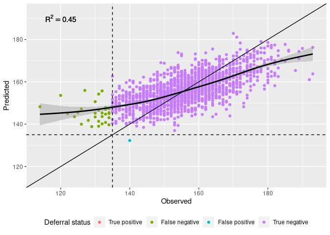
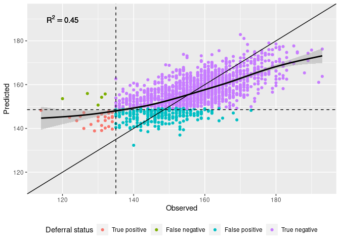

## Effect sizes and importances of variables

Effect sizes of variables from eProgesa and Biobank using dynamic linear
mixed model. In addition, variables importance from random forest
algorithm.

    # Creates a forest plot of means and confidence intervals from posterior distributions.
    # Puts both male and female results in the same plot.
    create_double_forest_plot <- function(male_posterior, female_posterior, variables, combined_variables, base_size = 11) {
      result <- get_dlmm_df(male_posterior, female_posterior, variables, combined_variables)
      cis <- result
      
      result <- result %>%
        mutate(Pretty=fct_rev(Pretty))

      plot <- result %>% 
        ggplot() +     
        geom_vline(aes(xintercept=0), color="lightgray") +
        geom_rect(data=combined_variables %>% filter(stripe==1), 
                  mapping=aes(ymax = as.numeric(Pretty) + 0.5,
                      ymin = as.numeric(Pretty) - 0.5),
                      #xmin = -Inf,
                      #xmax = Inf,
                      fill = "gray", xmin=-Inf, xmax=Inf, alpha = 0.1, show.legend = FALSE, colour=NA) +
        ggstance::geom_pointrangeh(aes(y=Pretty, x=mean, xmin=low, xmax=high, color=gender),
                                   position=position_dodge2(width=0.8, padding=0.1), size=0.25) + # ggstance is required to make legend keys horizontal
        labs(title="", #title="Effects sizes of variables on Hb prediction",
             x="Regression coefficient", y=NULL, colour="Sex") +
        scale_colour_discrete(drop=FALSE, breaks = c("male", "female")) + 
        scale_y_discrete() + # !!!!! This is important. Solves the problem with position_dodge2 and the order of rect and pointrange geoms !!!!!!
                             # Otherwise following error results: Error: Discrete value supplied to continuous scale
        #guides(colour = guide_legend(reverse = TRUE)) + # Reverse the order of keys in the legend
        #theme_gray(base_size = base_size) + theme(legend.position = "bottom", legend.direction = "horizontal")
        theme_classic(base_size = base_size) + theme(legend.position = "bottom", legend.direction = "horizontal")
      return(list(plot=plot, cis=cis))
    }

    create_variable_importance_plot2 <- function(rrfFit_roc, descript, combined_variables, base_size = 11) {
      rrfFit.varimp <- get_rf_df(rrfFit_roc, descript, combined_variables)
      

      var_imp <- rrfFit.varimp %>%
          mutate(Pretty=fct_rev(Pretty))
                 
      varimp.plot <- var_imp %>% 
        ggplot() + 
        geom_rect(data=combined_variables %>% filter(stripe==1),
                  mapping=aes(ymax = as.numeric(Pretty) + 0.5,
                              ymin = as.numeric(Pretty) - 0.5),
                  #xmin = -Inf,
                  #xmax = Inf,
                  #fill = stripe), 
                  xmin=-Inf, xmax=Inf, alpha = 0.1, colour=NA, fill="gray", show.legend = FALSE, inherit.aes = FALSE) +
        ggstance::geom_pointrangeh(aes(y=Pretty, x=Importance, xmin=0, xmax=Importance, colour = gender), # ggstance is required to make legend keys horizontal
                                   position=position_dodge2(width=0.8, padding=0.1), size=0.25, inherit.aes = FALSE) +   
                                   #colour = hue_pal()(3)[2], size=0.25) +
        labs(y=NULL, colour="Sex") + 
        guides(y="none") +
        scale_colour_discrete(drop=FALSE, breaks=c("both")) +
        scale_y_discrete() + # !!!!! This is important. Solves the problem with position_dodge2 and the order of rect and pointrange geoms !!!!!!
                             # Otherwise following error results: Error: Discrete value supplied to continuous scale
        #theme_gray(base_size = base_size)
        theme_classic(base_size = base_size) + theme(legend.position = "bottom", legend.direction = "horizontal")

      return(varimp.plot)
    }

      
    create_forest_importance_plot <- function(male_posterior, female_posterior, variables,
                                               filename=NULL,
                                               width = 180,  # width of the combined figure in millimetres
                                              base_size = 11
    ) {
      rrfFit_roc <- load_single("~/FRCBS/interval_prediction/results/rrfFit_roc.rdata")
      
      combined_variables <- tibble(Pretty=c(variables, "Life time donations", "Sex", "First Hb")) %>%
        mutate(stripe=factor(row_number()%%2),    # this is used to make the gray/white background
               Pretty=factor(Pretty, levels=Pretty))
      
      forest <- create_double_forest_plot(male_posterior, female_posterior, variables, combined_variables, base_size = base_size)$plot
      importance <- create_variable_importance_plot2(rrfFit_roc, descript, combined_variables, base_size = base_size)
      
      use_cowplot <- TRUE
      
      if (use_cowplot) {
        forest_importance <- cowplot::plot_grid(forest, importance, labels = c('A', 'B'), label_size = 12, nrow=1, scale=1.0, axis="tb", align="h",
                                                rel_widths = c(2, 1))
        if (!is.null(filename)) {
          cowplot::save_plot(filename, forest_importance, title="Effect sizes and importances",
                             ncol = 2, base_asp = 1.0, base_width = width / 25.4 / 2, base_height = NULL)
        }
      } else {
        forest_importance <- gridExtra::grid.arrange(forest, importance, nrow = 1, respect=TRUE)   # Combine the plots
        if (!is.null(filename)) {
          ggsave(filename=filename, forest_importance, width = width, units="mm", dpi=600, scale=1.0)
        }
      }
      forest_importance
    }

    if (save_figs) {
        filename <- paste(fig_path, "old-effect-size-importance.pdf", sep="/")
    } else {
        filename <- NULL
    }
    create_forest_importance_plot(male_posterior, female_posterior, variables, filename=filename)

## Alternative effect sizes and importances of variables

    res <- alternative_create_forest_importance_plot(male_posterior, female_posterior, variables, filename=filename)
    g <- res$plot
    final <- res$final
    if (save_figs)
      ggsave(filename="effect-size-importance.pdf", title="Effect sizes and importances", path=fig_path, plot=g, dpi=600, units="mm", width=180)
      ggsave(filename="presentation-effect-size-importance.pdf", title="Effect sizes and importances", path=fig_path, plot=g, dpi=600, units="mm", width=180, height=90)

    ## Warning: Removed 13 rows containing missing values (geom_pointrangeh).

    g

    ## Warning: Removed 13 rows containing missing values (geom_pointrangeh).

## Performance forest plot

    res <- create_performance_forest_plot()

    ## 
    ## ── Column specification ────────────────────────────────────────────────────────
    ## cols(
    ##   Id = col_character(),
    ##   variable = col_character(),
    ##   type = col_character(),
    ##   value = col_double()
    ## )

    g <- res$g
    df <- res$df
    if (save_figs)
      ggsave(filename="performance-forest-plot.pdf", #  title="Performance forest plot", 
             path=fig_path, plot=g, dpi=600, units="mm", width=180, device=cairo_pdf)
    g

    ## Warning: Removed 1 rows containing missing values (geom_pointrangeh).

## Calibration plots

    g <- calibration_plots(ids)

    ## `summarise()` has grouped output by 'Id'. You can override using the `.groups` argument.

    if (save_figs)
      ggsave(filename="calibration_plots.pdf", title="Calibration plots", path=fig_path, plot=g, dpi=600, units="mm", width=180)
    g

    ## Warning: Transformation introduced infinite values in discrete y-axis

    ## Warning: Removed 26 rows containing missing values (geom_point).

    ## Warning: Removed 26 rows containing missing values (geom_text).

## Classification scatter plot for male Finngen DLMM

    g1 <- create_classification_scatter_plot(finngenn_male_raw$comp_df, 135, NULL)

    ## Prediction threshold is 135.0
    ## Incorrectly predicting 0.1% of accepted donations as deferrals
    ## Correctly predicting 0.0% of deferred donations as deferrals

    g2 <- create_classification_scatter_plot(finngenn_male_raw$comp_df, 135, 0.04)

    ## Prediction threshold is 148.6
    ## Incorrectly predicting 17.0% of accepted donations as deferrals
    ## Correctly predicting 83.9% of deferred donations as deferrals

    if (save_figs) {
      ggsave(filename="classification-scatter-plot-hb-finngen-male-dlmm.pdf", title="Classifiction scatter plot finngen-male-dlmm", path=fig_path, 
             plot=g1, dpi=600, units="mm", width=180)
      ggsave(filename="classification-scatter-plot-probability-finngen-male-dlmm.pdf", title="Classifiction scatter plot finngen-male-dlmm", path=fig_path, 
             plot=g2, dpi=600, units="mm", width=180)
    }
    g1

    ## `geom_smooth()` using method = 'gam' and formula 'y ~ s(x, bs = "cs")'

    ## Warning in is.na(x): is.na() applied to non-(list or vector) of type 'language'

    g2

    ## `geom_smooth()` using method = 'gam' and formula 'y ~ s(x, bs = "cs")'

    ## Warning in is.na(x): is.na() applied to non-(list or vector) of type 'language'

Testing the effect of base\_size parameter.

    base_size <- 20
    presentation1 <- g1 + coord_fixed() + theme_gray(base_size=base_size)
    presentation2 <- g2 + coord_fixed() + theme_gray(base_size=base_size)
    if (save_figs) {
      ggsave(filename="presentation-classification-scatter-plot-hb-finngen-male-dlmm.pdf", title="Classifiction scatter plot finngen-male-dlmm", path=fig_path, 
             plot=presentation1, dpi=600, units="mm", width=180, height=120)
      ggsave(filename="presentation-classification-scatter-plot-probability-finngen-male-dlmm.pdf", title="Classifiction scatter plot finngen-male-dlmm", path=fig_path, 
             plot=presentation2, dpi=600, units="mm", width=180, height=120)
    }

Pretty print results as a table.

    df <- read_csv("~/FRCBS/results-for-eba-paper/raw-data-2020-12-01.csv")

    ## 
    ## ── Column specification ────────────────────────────────────────────────────────
    ## cols(
    ##   Id = col_character(),
    ##   variable = col_character(),
    ##   type = col_character(),
    ##   value = col_double()
    ## )

    df <- df %>% 
      pivot_wider(names_from=c("variable", "type"), values_from=value, names_glue="{variable} {type}")
    names(df) <- str_remove(names(df), " value$")
    df2 <- df %>%
      select("Id", "AUROC", "AUROC low", "AUROC high", "AUPR", "AUPR low", "AUPR high", "F1", "F1 low", "F1 high", "threshold6", "threshold12", "E6", "E6 low", "E6 high", "E12", "E12 low", "E12 high")
    kable(df2, digits=2)

<table style="width:100%;">
<colgroup>
<col style="width: 13%" />
<col style="width: 3%" />
<col style="width: 6%" />
<col style="width: 6%" />
<col style="width: 3%" />
<col style="width: 5%" />
<col style="width: 6%" />
<col style="width: 3%" />
<col style="width: 4%" />
<col style="width: 5%" />
<col style="width: 6%" />
<col style="width: 7%" />
<col style="width: 3%" />
<col style="width: 4%" />
<col style="width: 5%" />
<col style="width: 3%" />
<col style="width: 5%" />
<col style="width: 5%" />
</colgroup>
<thead>
<tr class="header">
<th style="text-align: left;">Id</th>
<th style="text-align: right;">AUROC</th>
<th style="text-align: right;">AUROC low</th>
<th style="text-align: right;">AUROC high</th>
<th style="text-align: right;">AUPR</th>
<th style="text-align: right;">AUPR low</th>
<th style="text-align: right;">AUPR high</th>
<th style="text-align: right;">F1</th>
<th style="text-align: right;">F1 low</th>
<th style="text-align: right;">F1 high</th>
<th style="text-align: right;">threshold6</th>
<th style="text-align: right;">threshold12</th>
<th style="text-align: right;">E6</th>
<th style="text-align: right;">E6 low</th>
<th style="text-align: right;">E6 high</th>
<th style="text-align: right;">E12</th>
<th style="text-align: right;">E12 low</th>
<th style="text-align: right;">E12 high</th>
</tr>
</thead>
<tbody>
<tr class="odd">
<td style="text-align: left;">progesa-male-lmm</td>
<td style="text-align: right;">0.85</td>
<td style="text-align: right;">0.84</td>
<td style="text-align: right;">0.87</td>
<td style="text-align: right;">0.18</td>
<td style="text-align: right;">0.14</td>
<td style="text-align: right;">0.21</td>
<td style="text-align: right;">0.02</td>
<td style="text-align: right;">0.00</td>
<td style="text-align: right;">0.03</td>
<td style="text-align: right;">0.04</td>
<td style="text-align: right;">0.08</td>
<td style="text-align: right;">-0.93</td>
<td style="text-align: right;">-1.01</td>
<td style="text-align: right;">-0.85</td>
<td style="text-align: right;">-0.27</td>
<td style="text-align: right;">-0.36</td>
<td style="text-align: right;">-0.18</td>
</tr>
<tr class="even">
<td style="text-align: left;">progesa-female-lmm</td>
<td style="text-align: right;">0.80</td>
<td style="text-align: right;">0.79</td>
<td style="text-align: right;">0.81</td>
<td style="text-align: right;">0.23</td>
<td style="text-align: right;">0.21</td>
<td style="text-align: right;">0.25</td>
<td style="text-align: right;">0.04</td>
<td style="text-align: right;">0.03</td>
<td style="text-align: right;">0.05</td>
<td style="text-align: right;">0.08</td>
<td style="text-align: right;">0.20</td>
<td style="text-align: right;">-0.71</td>
<td style="text-align: right;">-0.75</td>
<td style="text-align: right;">-0.66</td>
<td style="text-align: right;">-0.08</td>
<td style="text-align: right;">-0.12</td>
<td style="text-align: right;">-0.03</td>
</tr>
<tr class="odd">
<td style="text-align: left;">progesa-male-dlmm</td>
<td style="text-align: right;">0.86</td>
<td style="text-align: right;">0.85</td>
<td style="text-align: right;">0.88</td>
<td style="text-align: right;">0.18</td>
<td style="text-align: right;">0.15</td>
<td style="text-align: right;">0.21</td>
<td style="text-align: right;">0.01</td>
<td style="text-align: right;">0.00</td>
<td style="text-align: right;">0.02</td>
<td style="text-align: right;">0.02</td>
<td style="text-align: right;">0.06</td>
<td style="text-align: right;">-0.95</td>
<td style="text-align: right;">-1.02</td>
<td style="text-align: right;">-0.88</td>
<td style="text-align: right;">-0.30</td>
<td style="text-align: right;">-0.39</td>
<td style="text-align: right;">-0.21</td>
</tr>
<tr class="even">
<td style="text-align: left;">progesa-female-dlmm</td>
<td style="text-align: right;">0.82</td>
<td style="text-align: right;">0.81</td>
<td style="text-align: right;">0.82</td>
<td style="text-align: right;">0.24</td>
<td style="text-align: right;">0.22</td>
<td style="text-align: right;">0.26</td>
<td style="text-align: right;">0.03</td>
<td style="text-align: right;">0.02</td>
<td style="text-align: right;">0.04</td>
<td style="text-align: right;">0.08</td>
<td style="text-align: right;">0.20</td>
<td style="text-align: right;">-0.75</td>
<td style="text-align: right;">-0.79</td>
<td style="text-align: right;">-0.70</td>
<td style="text-align: right;">-0.09</td>
<td style="text-align: right;">-0.14</td>
<td style="text-align: right;">-0.05</td>
</tr>
<tr class="odd">
<td style="text-align: left;">finngen-male-dlmm</td>
<td style="text-align: right;">0.89</td>
<td style="text-align: right;">0.84</td>
<td style="text-align: right;">0.95</td>
<td style="text-align: right;">0.17</td>
<td style="text-align: right;">0.05</td>
<td style="text-align: right;">0.27</td>
<td style="text-align: right;">NaN</td>
<td style="text-align: right;">NaN</td>
<td style="text-align: right;">NaN</td>
<td style="text-align: right;">0.04</td>
<td style="text-align: right;">0.08</td>
<td style="text-align: right;">-1.16</td>
<td style="text-align: right;">-1.42</td>
<td style="text-align: right;">-0.90</td>
<td style="text-align: right;">-0.58</td>
<td style="text-align: right;">-0.92</td>
<td style="text-align: right;">-0.23</td>
</tr>
<tr class="even">
<td style="text-align: left;">finngen-female-dlmm</td>
<td style="text-align: right;">0.80</td>
<td style="text-align: right;">0.76</td>
<td style="text-align: right;">0.85</td>
<td style="text-align: right;">0.18</td>
<td style="text-align: right;">0.10</td>
<td style="text-align: right;">0.24</td>
<td style="text-align: right;">0.04</td>
<td style="text-align: right;">-0.01</td>
<td style="text-align: right;">0.08</td>
<td style="text-align: right;">0.12</td>
<td style="text-align: right;">0.24</td>
<td style="text-align: right;">-0.76</td>
<td style="text-align: right;">-0.95</td>
<td style="text-align: right;">-0.57</td>
<td style="text-align: right;">-0.17</td>
<td style="text-align: right;">-0.36</td>
<td style="text-align: right;">0.01</td>
</tr>
<tr class="odd">
<td style="text-align: left;">findonor-male-dlmm</td>
<td style="text-align: right;">0.76</td>
<td style="text-align: right;">0.65</td>
<td style="text-align: right;">0.88</td>
<td style="text-align: right;">0.06</td>
<td style="text-align: right;">-0.08</td>
<td style="text-align: right;">0.15</td>
<td style="text-align: right;">0.11</td>
<td style="text-align: right;">-0.09</td>
<td style="text-align: right;">0.19</td>
<td style="text-align: right;">0.14</td>
<td style="text-align: right;">0.30</td>
<td style="text-align: right;">-0.62</td>
<td style="text-align: right;">-1.13</td>
<td style="text-align: right;">-0.11</td>
<td style="text-align: right;">-0.17</td>
<td style="text-align: right;">-0.65</td>
<td style="text-align: right;">0.33</td>
</tr>
<tr class="even">
<td style="text-align: left;">findonor-female-dlmm</td>
<td style="text-align: right;">0.82</td>
<td style="text-align: right;">0.76</td>
<td style="text-align: right;">0.87</td>
<td style="text-align: right;">0.21</td>
<td style="text-align: right;">0.12</td>
<td style="text-align: right;">0.29</td>
<td style="text-align: right;">0.10</td>
<td style="text-align: right;">0.01</td>
<td style="text-align: right;">0.19</td>
<td style="text-align: right;">0.18</td>
<td style="text-align: right;">0.28</td>
<td style="text-align: right;">-0.85</td>
<td style="text-align: right;">-1.07</td>
<td style="text-align: right;">-0.63</td>
<td style="text-align: right;">-0.21</td>
<td style="text-align: right;">-0.47</td>
<td style="text-align: right;">0.04</td>
</tr>
<tr class="odd">
<td style="text-align: left;">progesa-both-dt</td>
<td style="text-align: right;">0.78</td>
<td style="text-align: right;">0.77</td>
<td style="text-align: right;">0.78</td>
<td style="text-align: right;">0.15</td>
<td style="text-align: right;">0.14</td>
<td style="text-align: right;">0.16</td>
<td style="text-align: right;">0.22</td>
<td style="text-align: right;">0.21</td>
<td style="text-align: right;">0.23</td>
<td style="text-align: right;">0.40</td>
<td style="text-align: right;">0.76</td>
<td style="text-align: right;">-0.76</td>
<td style="text-align: right;">-0.79</td>
<td style="text-align: right;">-0.72</td>
<td style="text-align: right;">0.03</td>
<td style="text-align: right;">0.00</td>
<td style="text-align: right;">0.06</td>
</tr>
<tr class="even">
<td style="text-align: left;">progesa-both-rf</td>
<td style="text-align: right;">0.86</td>
<td style="text-align: right;">0.85</td>
<td style="text-align: right;">0.86</td>
<td style="text-align: right;">0.20</td>
<td style="text-align: right;">0.18</td>
<td style="text-align: right;">0.21</td>
<td style="text-align: right;">0.25</td>
<td style="text-align: right;">0.24</td>
<td style="text-align: right;">0.26</td>
<td style="text-align: right;">0.48</td>
<td style="text-align: right;">0.76</td>
<td style="text-align: right;">-0.92</td>
<td style="text-align: right;">-0.96</td>
<td style="text-align: right;">-0.89</td>
<td style="text-align: right;">-0.28</td>
<td style="text-align: right;">-0.32</td>
<td style="text-align: right;">-0.24</td>
</tr>
<tr class="odd">
<td style="text-align: left;">progesa-male-dummy</td>
<td style="text-align: right;">0.83</td>
<td style="text-align: right;">0.82</td>
<td style="text-align: right;">0.85</td>
<td style="text-align: right;">0.11</td>
<td style="text-align: right;">0.09</td>
<td style="text-align: right;">0.13</td>
<td style="text-align: right;">0.16</td>
<td style="text-align: right;">0.14</td>
<td style="text-align: right;">0.17</td>
<td style="text-align: right;">0.36</td>
<td style="text-align: right;">0.58</td>
<td style="text-align: right;">-0.84</td>
<td style="text-align: right;">-0.93</td>
<td style="text-align: right;">-0.75</td>
<td style="text-align: right;">-0.19</td>
<td style="text-align: right;">-0.29</td>
<td style="text-align: right;">-0.10</td>
</tr>
<tr class="even">
<td style="text-align: left;">progesa-female-dummy</td>
<td style="text-align: right;">0.77</td>
<td style="text-align: right;">0.76</td>
<td style="text-align: right;">0.78</td>
<td style="text-align: right;">0.18</td>
<td style="text-align: right;">0.17</td>
<td style="text-align: right;">0.20</td>
<td style="text-align: right;">0.20</td>
<td style="text-align: right;">0.19</td>
<td style="text-align: right;">0.20</td>
<td style="text-align: right;">0.64</td>
<td style="text-align: right;">0.90</td>
<td style="text-align: right;">-0.60</td>
<td style="text-align: right;">-0.64</td>
<td style="text-align: right;">-0.56</td>
<td style="text-align: right;">0.12</td>
<td style="text-align: right;">0.09</td>
<td style="text-align: right;">0.16</td>
</tr>
</tbody>
</table>

Create a table of atot and TPR and FPR values for each method/data. Q is
the fraction of avoided deferrals.

    #data_frames <- map(dummy2_ids, get_data_frame)
    df2 <- df %>% select(Id, threshold6, threshold12)  # Get the optimal thresholds

    helper <- function(Id, threshold6, threshold12) {
      df2 <- get_data_frame(Id)
      r6 <- get_rates(df2, threshold6)
      r12 <- get_rates(df2, threshold12)
      df <- get_cost(r6$TPR, r6$FPR, r12$TPR, r12$FPR, p = parameters)
      #df <- tibble(a=1, b=2)
      df$Id <- Id
      return(df %>% select(Id, everything()))  
    }

    d <- get_mikkos_cost_constants()$d  # Fraction of deferrals of all donors
    result <- pmap_dfr(df2, helper) 
    result <- result %>%
      mutate(across(c(q6, q12), function(x) x / d)) %>%
      rename(Q6=q6, Q12=q12)
    kable(result, digits=3)

<table>
<thead>
<tr class="header">
<th style="text-align: left;">Id</th>
<th style="text-align: right;">Q6</th>
<th style="text-align: right;">Q12</th>
<th style="text-align: right;">a6</th>
<th style="text-align: right;">a12</th>
<th style="text-align: right;">E6</th>
<th style="text-align: right;">E12</th>
<th style="text-align: right;">TPR6</th>
<th style="text-align: right;">FPR6</th>
<th style="text-align: right;">TPR12</th>
<th style="text-align: right;">FPR12</th>
</tr>
</thead>
<tbody>
<tr class="odd">
<td style="text-align: left;">progesa-male-lmm</td>
<td style="text-align: right;">0.720</td>
<td style="text-align: right;">0.500</td>
<td style="text-align: right;">1.276</td>
<td style="text-align: right;">1.417</td>
<td style="text-align: right;">-0.934</td>
<td style="text-align: right;">-0.268</td>
<td style="text-align: right;">0.720</td>
<td style="text-align: right;">0.165</td>
<td style="text-align: right;">0.500</td>
<td style="text-align: right;">0.080</td>
</tr>
<tr class="even">
<td style="text-align: left;">progesa-female-lmm</td>
<td style="text-align: right;">0.705</td>
<td style="text-align: right;">0.340</td>
<td style="text-align: right;">1.393</td>
<td style="text-align: right;">1.342</td>
<td style="text-align: right;">-0.707</td>
<td style="text-align: right;">-0.076</td>
<td style="text-align: right;">0.705</td>
<td style="text-align: right;">0.248</td>
<td style="text-align: right;">0.340</td>
<td style="text-align: right;">0.060</td>
</tr>
<tr class="odd">
<td style="text-align: left;">progesa-male-dlmm</td>
<td style="text-align: right;">0.838</td>
<td style="text-align: right;">0.602</td>
<td style="text-align: right;">1.405</td>
<td style="text-align: right;">1.522</td>
<td style="text-align: right;">-0.950</td>
<td style="text-align: right;">-0.297</td>
<td style="text-align: right;">0.838</td>
<td style="text-align: right;">0.256</td>
<td style="text-align: right;">0.602</td>
<td style="text-align: right;">0.107</td>
</tr>
<tr class="even">
<td style="text-align: left;">progesa-female-dlmm</td>
<td style="text-align: right;">0.706</td>
<td style="text-align: right;">0.328</td>
<td style="text-align: right;">1.372</td>
<td style="text-align: right;">1.318</td>
<td style="text-align: right;">-0.746</td>
<td style="text-align: right;">-0.093</td>
<td style="text-align: right;">0.706</td>
<td style="text-align: right;">0.233</td>
<td style="text-align: right;">0.328</td>
<td style="text-align: right;">0.054</td>
</tr>
<tr class="odd">
<td style="text-align: left;">finngen-male-dlmm</td>
<td style="text-align: right;">0.839</td>
<td style="text-align: right;">0.645</td>
<td style="text-align: right;">1.282</td>
<td style="text-align: right;">1.402</td>
<td style="text-align: right;">-1.156</td>
<td style="text-align: right;">-0.577</td>
<td style="text-align: right;">0.839</td>
<td style="text-align: right;">0.170</td>
<td style="text-align: right;">0.645</td>
<td style="text-align: right;">0.076</td>
</tr>
<tr class="even">
<td style="text-align: left;">finngen-female-dlmm</td>
<td style="text-align: right;">0.646</td>
<td style="text-align: right;">0.302</td>
<td style="text-align: right;">1.291</td>
<td style="text-align: right;">1.240</td>
<td style="text-align: right;">-0.762</td>
<td style="text-align: right;">-0.175</td>
<td style="text-align: right;">0.646</td>
<td style="text-align: right;">0.176</td>
<td style="text-align: right;">0.302</td>
<td style="text-align: right;">0.033</td>
</tr>
<tr class="odd">
<td style="text-align: left;">findonor-male-dlmm</td>
<td style="text-align: right;">0.533</td>
<td style="text-align: right;">0.333</td>
<td style="text-align: right;">1.243</td>
<td style="text-align: right;">1.280</td>
<td style="text-align: right;">-0.623</td>
<td style="text-align: right;">-0.169</td>
<td style="text-align: right;">0.533</td>
<td style="text-align: right;">0.142</td>
<td style="text-align: right;">0.333</td>
<td style="text-align: right;">0.044</td>
</tr>
<tr class="even">
<td style="text-align: left;">findonor-female-dlmm</td>
<td style="text-align: right;">0.727</td>
<td style="text-align: right;">0.455</td>
<td style="text-align: right;">1.334</td>
<td style="text-align: right;">1.396</td>
<td style="text-align: right;">-0.850</td>
<td style="text-align: right;">-0.212</td>
<td style="text-align: right;">0.727</td>
<td style="text-align: right;">0.206</td>
<td style="text-align: right;">0.455</td>
<td style="text-align: right;">0.074</td>
</tr>
<tr class="odd">
<td style="text-align: left;">progesa-both-dt</td>
<td style="text-align: right;">0.724</td>
<td style="text-align: right;">0.191</td>
<td style="text-align: right;">1.387</td>
<td style="text-align: right;">1.233</td>
<td style="text-align: right;">-0.755</td>
<td style="text-align: right;">0.031</td>
<td style="text-align: right;">0.724</td>
<td style="text-align: right;">0.243</td>
<td style="text-align: right;">0.191</td>
<td style="text-align: right;">0.031</td>
</tr>
<tr class="even">
<td style="text-align: left;">progesa-both-rf</td>
<td style="text-align: right;">0.797</td>
<td style="text-align: right;">0.539</td>
<td style="text-align: right;">1.372</td>
<td style="text-align: right;">1.458</td>
<td style="text-align: right;">-0.924</td>
<td style="text-align: right;">-0.276</td>
<td style="text-align: right;">0.797</td>
<td style="text-align: right;">0.233</td>
<td style="text-align: right;">0.539</td>
<td style="text-align: right;">0.090</td>
</tr>
<tr class="odd">
<td style="text-align: left;">progesa-male-dummy</td>
<td style="text-align: right;">0.704</td>
<td style="text-align: right;">0.425</td>
<td style="text-align: right;">1.312</td>
<td style="text-align: right;">1.375</td>
<td style="text-align: right;">-0.842</td>
<td style="text-align: right;">-0.190</td>
<td style="text-align: right;">0.704</td>
<td style="text-align: right;">0.191</td>
<td style="text-align: right;">0.425</td>
<td style="text-align: right;">0.069</td>
</tr>
<tr class="even">
<td style="text-align: left;">progesa-female-dummy</td>
<td style="text-align: right;">0.714</td>
<td style="text-align: right;">0.127</td>
<td style="text-align: right;">1.468</td>
<td style="text-align: right;">1.215</td>
<td style="text-align: right;">-0.605</td>
<td style="text-align: right;">0.125</td>
<td style="text-align: right;">0.714</td>
<td style="text-align: right;">0.300</td>
<td style="text-align: right;">0.127</td>
<td style="text-align: right;">0.026</td>
</tr>
</tbody>
</table>
