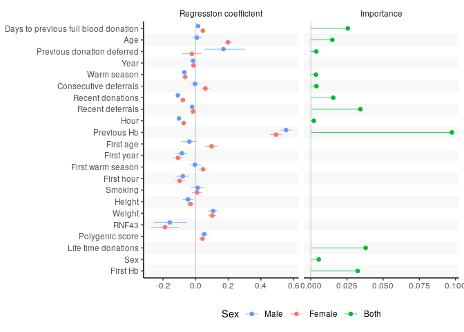
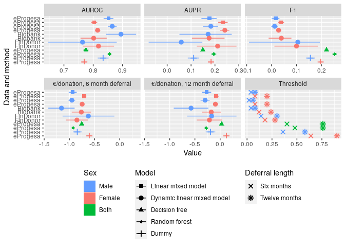

    descript <- tibble(Variable = c("donor", "Hb", "days_to_previous_fb", "age", "previous_Hb_def", 
                                    "year", "warm_season", "consecutive_deferrals", "recent_donations",
                                    "recent_deferrals", "hour", 
                                    "previous_Hb", "Hb_first", "Hb_deferral","nb_donat","gender"), 
                       Pretty = c("Donor ID", "Hemoglobin", "Days to previous full blood donation", "Age", 
                                  "Previous donation deferred", #"Previous Hb deferral",   # This is a more descriptive name
                                  "Year", "Warm season", "Consecutive deferrals", "Recent donations", 
                                  "Recent deferrals", "Hour", 
                                  "Previous Hb", "First Hb", "Hb deferral","Life time donations","Sex"),
                       Type = c("Factor", "numeric", "numeric (int)", "numeric", "boolean",
                                "numeric (int)", "boolean", "numeric (int)", "numeric (int)", "numeric (int)", "numeric",
                                "numeric", "numeric", "boolean","numeric (int)","Factor"),
                       Explanation = c("Donor identifier",
                                       "Amount of Hemoglobin",
                                       "Time (in days) between Hb measurement and previous full blood donation event",
                                       "Age of donor",
                                       "Indicates whether the donor was deferred from blood donation due to low hemoglobin at previous donation event",
                                       "Year of donation",
                                       "True if donation was given in April-September",
                                       "Amount of times the donor has been deferred due to low hemoglobin since last succesful whole blood donation",
                                       "Amount of donations in the last two years",
                                       "Amount of deferrals due to low hemoglobin in the last two years",
                                       "Time of day when donation was given as hours (e.g. 13:45 = 13.75)",
                                       "Hb value at previous measurement (ICP-model)",
                                       "Hb value at first donation of this donor (Non ICP-model)",
                                       "Deferred based on low hemoglogin",
                                      "Life time total count of donations",
                                      "Sex"
                       )
                       )

Effect sizes and importances of variables
-----------------------------------------

Effect sizes of variables from eProgesa and Biobank using dynamic linear
mixed model. In addition, variables importance from random forest
algorithm.

    get_dlmm_df <- function(male_posterior, female_posterior, variables, combined_variables) {
        for (gender in c("male", "female")) {
        #posterior <- ifelse(gender == "male", male_posterior, female_posterior)
        if (gender == "male") {
          posterior <- male_posterior
        } else {
          posterior <- female_posterior
        }
        
        for (i in seq_along(posterior)) {
          #cat(sprintf("Gender %s, Column %i\n", gender, i))
          v <- posterior[[i]]
          ci_hdi <- bayestestR::ci(v, method = "HDI", ci=0.95)
          #str(ci_hdi)
          L <- list(names = variables[[i]], gender=gender, mean = mean(v), low = ci_hdi$CI_low, high = ci_hdi$CI_high)
          if (i == 1 && gender=="male") {
            result <- data.frame(L, stringsAsFactors = FALSE)
          } else {
            result <- rbind(result, L)
          }
        }
      }
      result <- as_tibble(result)
      result <- result %>%
        mutate(gender = factor(gender, levels=c("female", "both", "male"))) %>%
        rename(Pretty=names) %>%
        mutate(Pretty=factor(Pretty, levels=levels(combined_variables$Pretty)))
      result <- left_join(combined_variables, result, by="Pretty")
      return(result)
      
    }

    get_rf_df <- function(rrfFit_roc, descript, combined_variables) {
      rrfFit_rocImp <- varImp(rrfFit_roc, scale = FALSE)
      #rrfFit.varimp <- as_tibble(cbind(rownames(rrfFit_rocImp$importance),rrfFit_rocImp$importance))
      rrfFit.varimp <- rownames_to_column(rrfFit_rocImp$importance)
      colnames(rrfFit.varimp) <- c("Variable","Importance")
      rrfFit.varimp <- left_join(rrfFit.varimp, descript, by=c("Variable"="Variable")) %>% select(Variable, Pretty, Importance) %>% arrange(Importance)
      
      rrfFit.varimp$Pretty[rrfFit.varimp$Variable == "previous_Hb_defTRUE"] <- "Previous donation deferred"
      rrfFit.varimp$Pretty[rrfFit.varimp$Variable == "warm_seasonTRUE"] <- "Warm season"
      rrfFit.varimp$Pretty[rrfFit.varimp$Variable == "genderWomen"] <- "Sex"
      
      rrfFit.varimp <- rrfFit.varimp %>% 
        mutate(Pretty=factor(Pretty, levels=levels(combined_variables$Pretty)),
               gender=factor("both", levels=c("female", "both", "male")))
      rrfFit.varimp <- left_join(combined_variables, rrfFit.varimp, by="Pretty")
      return(rrfFit.varimp)  
    }

    # Creates a forest plot of means and confidence intervals from posterior distributions.
    # Puts both male and female results in the same plot.
    create_double_forest_plot <- function(male_posterior, female_posterior, variables, combined_variables, base_size = 11) {
      result <- get_dlmm_df(male_posterior, female_posterior, variables, combined_variables)
      cis <- result
      
      result <- result %>%
        mutate(Pretty=fct_rev(Pretty))

      plot <- result %>% 
        ggplot() +     
        geom_vline(aes(xintercept=0), color="lightgray") +
        ggstance::geom_pointrangeh(aes(y=Pretty, x=mean, xmin=low, xmax=high, color=gender),
                                   position=position_dodge2(width=0.8, padding=0.1), size=0.25) + # ggstance is required to make legend keys horizontal
        geom_rect(data=combined_variables %>% filter(stripe==1), 
                  mapping=aes(ymax = as.numeric(Pretty) + 0.5,
                      ymin = as.numeric(Pretty) - 0.5),
                      #xmin = -Inf,
                      #xmax = Inf,
                      fill = "gray", xmin=-Inf, xmax=Inf, alpha = 0.1, show.legend = FALSE, colour=NA) +
        labs(title="", #title="Effects sizes of variables on Hb prediction",
             x="Regression coefficient", y=NULL, colour="Sex") +
        scale_colour_discrete(drop=FALSE, breaks = c("male", "female")) + 
        #guides(colour = guide_legend(reverse = TRUE)) + # Reverse the order of keys in the legend
        #theme_gray(base_size = base_size) + theme(legend.position = "bottom", legend.direction = "horizontal")
        theme_classic(base_size = base_size) + theme(legend.position = "bottom", legend.direction = "horizontal")
      return(list(plot=plot, cis=cis))
    }

    create_variable_importance_plot2 <- function(rrfFit_roc, descript, combined_variables, base_size = 11) {
      rrfFit.varimp <- get_rf_df(rrfFit_roc, descript, combined_variables)
      

      var_imp <- rrfFit.varimp %>%
          mutate(Pretty=fct_rev(Pretty))
                 
      varimp.plot <- var_imp %>% 
        ggplot() + 
        ggstance::geom_pointrangeh(aes(y=Pretty, x=Importance, xmin=0, xmax=Importance, colour = gender), # ggstance is required to make legend keys horizontal
                                   position=position_dodge2(width=0.8, padding=0.1), size=0.25, inherit.aes = FALSE) +   
                                   #colour = hue_pal()(3)[2], size=0.25) +
          geom_rect(data=combined_variables %>% filter(stripe==1),
                  mapping=aes(ymax = as.numeric(Pretty) + 0.5,
                        ymin = as.numeric(Pretty) - 0.5),
                        #xmin = -Inf,
                        #xmax = Inf,
                        #fill = stripe), 
                  xmin=-Inf, xmax=Inf, alpha = 0.1, colour=NA, fill="gray", show.legend = FALSE, inherit.aes = FALSE) +
        labs(y=NULL, colour="Sex") + 
        guides(y="none") +
        scale_colour_discrete(drop=FALSE, breaks=c("both")) +
        #theme_gray(base_size = base_size)
        theme_classic(base_size = base_size) + theme(legend.position = "bottom", legend.direction = "horizontal")

      return(varimp.plot)
    }

      
    create_forest_importance_plot <- function(male_posterior, female_posterior, variables,
                                               filename=NULL,
                                               width = 180,  # width of the combined figure in millimetres
                                              base_size = 11
    ) {
      rrfFit_roc <- load_single("~/FRCBS/interval_prediction/results/rrfFit_roc.rdata")
      
      combined_variables <- tibble(Pretty=c(variables, "Life time donations", "Sex", "First Hb")) %>%
        mutate(stripe=factor(row_number()%%2),    # this is used to make the gray/white background
               Pretty=factor(Pretty, levels=Pretty))
      
      forest <- create_double_forest_plot(male_posterior, female_posterior, variables, combined_variables, base_size = base_size)$plot
      importance <- create_variable_importance_plot2(rrfFit_roc, descript, combined_variables, base_size = base_size)
      
      use_cowplot <- TRUE
      
      if (use_cowplot) {
        forest_importance <- cowplot::plot_grid(forest, importance, labels = c('A', 'B'), label_size = 12, nrow=1, scale=1.0, axis="tb", align="h",
                                                rel_widths = c(2, 1))
        if (!is.null(filename)) {
          cowplot::save_plot(filename, forest_importance, title="Effect sizes and importances",
                             ncol = 2, base_asp = 1.0, base_width = width / 25.4 / 2, base_height = NULL)
        }
      } else {
        forest_importance <- gridExtra::grid.arrange(forest, importance, nrow = 1, respect=TRUE)   # Combine the plots
        if (!is.null(filename)) {
          ggsave(filename=filename, forest_importance, width = width, units="mm", dpi=600, scale=1.0)
        }
      }
      forest_importance
    }

    finngenn_male_raw <- get_raw_result_list("finngen-male-dlmm")
    finngenn_female_raw <- get_raw_result_list("finngen-female-dlmm")
    male_posterior <- finngenn_male_raw$samples
    female_posterior <- finngenn_female_raw$samples
    variables <- finngenn_male_raw$pretty_variable_names
    # Give a more descriptive name to this variable
    variables <- replace(variables, variables=="Previous Hb deferral", "Previous donation deferred")

    if (save_figs) {
        filename <- paste(fig_path, "effect_size_importance.pdf", sep="/")
    } else {
        filename <- NULL
    }
    create_forest_importance_plot(male_posterior, female_posterior, variables, filename=filename)

    ## Warning: Removed 3 rows containing missing values (geom_pointrangeh).

    ## Warning: Removed 10 rows containing missing values (geom_pointrangeh).

\#\# Alternative effect sizes and importances of variables

    alternative_create_forest_importance_plot <- function(male_posterior, female_posterior, variables,
                                               filename=NULL,
                                               width = 180,  # width of the combined figure in millimetres
                                              base_size = 11
    ) {
      rrfFit_roc <- load_single("~/FRCBS/interval_prediction/results/rrfFit_roc.rdata")
      
      combined_variables <- tibble(Pretty=c(variables, "Life time donations", "Sex", "First Hb")) %>%
        mutate(stripe=factor(row_number()%%2),    # this is used to make the gray/white background
               Pretty=factor(Pretty, levels=Pretty))
      
      result <- get_dlmm_df(male_posterior, female_posterior, variables, combined_variables)
      varimp <- get_rf_df(rrfFit_roc, descript, combined_variables)
      
      result <- result %>%
        mutate(Pretty=fct_rev(Pretty))

      var_imp <- varimp %>%
        mutate(Pretty=fct_rev(Pretty),
               mean=Importance,
               low=0,
               high=Importance)

      final <- bind_rows(`Regression coefficient`=result, Importance=var_imp, .id="method") %>%
        mutate(method=factor(method, levels=c("Regression coefficient", "Importance")))
      
      plot <- final %>% 
        ggplot() +     
        geom_vline(aes(xintercept=0), color="lightgray") +
        ggstance::geom_pointrangeh(aes(y=Pretty, x=mean, xmin=low, xmax=high, color=gender),
                                   position=position_dodge2(width=0.8, padding=0.1), size=0.25) + # ggstance is required to make legend keys horizontal
        geom_rect(data=combined_variables %>% filter(stripe==1), 
                  mapping=aes(ymax = as.numeric(Pretty) + 0.5,
                              ymin = as.numeric(Pretty) - 0.5),
                  fill = "gray", xmin=-Inf, xmax=Inf, alpha = 0.1, show.legend = FALSE, colour=NA) +
        labs(title=NULL,
             x=NULL, y=NULL, colour="Sex") +
        scale_colour_discrete(drop=FALSE, breaks = c("male", "female", "both")) + 
        facet_wrap("method", scales="free_x") +
        theme_classic(base_size = base_size) + 
        theme(legend.position = "bottom", legend.direction = "horizontal", strip.background = element_rect(fill = NULL, color = "white", size = 1))
      
                 
    #    ggstance::geom_pointrangeh(aes(y=Pretty, x=Importance, xmin=0, xmax=Importance, colour = gender), # ggstance is required to make legend keys horizontal
    #                               position=position_dodge2(width=0.8, padding=0.1), size=0.25, inherit.aes = FALSE) +   
         
        #inherit.aes = FALSE) +
    #    guides(y="none") +

      return(list(plot=plot, final=final))
    }

    g <- alternative_create_forest_importance_plot(male_posterior, female_posterior, variables, filename=filename)

    if (save_figs)
      ggsave(filename="alternative_effect_size_importance.pdf", title="Performance forest plot", path=fig_path, plot=g, dpi=600, units="mm", width=180)
    g

    ## $plot

    ## Warning: Removed 13 rows containing missing values (geom_pointrangeh).

    ## 
    ## $final
    ## # A tibble: 63 x 9
    ##    method   Pretty  stripe gender     mean      low     high Variable Importance
    ##    <fct>    <fct>   <fct>  <fct>     <dbl>    <dbl>    <dbl> <chr>         <dbl>
    ##  1 Regress… Days t… 1      male    0.0152   0.00691  2.41e-2 <NA>             NA
    ##  2 Regress… Days t… 1      female  0.0446   0.0353   5.38e-2 <NA>             NA
    ##  3 Regress… Age     0      male    0.00742 -0.0190   3.49e-2 <NA>             NA
    ##  4 Regress… Age     0      female  0.198    0.176    2.22e-1 <NA>             NA
    ##  5 Regress… Previo… 1      male    0.171    0.0523   3.03e-1 <NA>             NA
    ##  6 Regress… Previo… 1      female -0.0224  -0.0807   3.81e-2 <NA>             NA
    ##  7 Regress… Year    0      male   -0.0166  -0.0299  -3.66e-3 <NA>             NA
    ##  8 Regress… Year    0      female -0.0130  -0.0245  -2.21e-4 <NA>             NA
    ##  9 Regress… Warm s… 1      male   -0.0684  -0.0758  -6.11e-2 <NA>             NA
    ## 10 Regress… Warm s… 1      female -0.0638  -0.0715  -5.69e-2 <NA>             NA
    ## # … with 53 more rows

Performance forest plot
-----------------------

    get_threshold_df <- function() {
      t6 <- tibble(
          Id = factor(ids),
          type = factor("Threshold"),
          value = c(0.1, 0.1, 0.1, 0.1, 0.1, 0.1, 0.2, 0.1, 0.4, 0.6))
      t12 <- tibble(
          Id = factor(ids),
          type = factor("Threshold"),
          value = c(0.2, 0.2, 0.1, 0.1, 0.1, 0.2, 0.3, 0.3, 0.8, 0.8)
      )
      t <- bind_rows(t6, t12)
      t <- t %>%
        mutate(low=value, 
               high=value,
               sex=factor(str_split_fixed(Id, "-", 3)[,2], levels=c("female", "both", "male")),
               model=factor(str_split_fixed(Id, "-", 3)[,3]))
      return(t)
    }

    # Show AUROC, AUPR, F1, E6, and E12 as forest plot
    create_performance_forest_plot <- function() {
      df <- read_csv("~/FRCBS/results-for-eba-paper/raw_data.csv")
      df <- df %>%
        mutate(Id=factor(Id, levels=rev(ids)),
               type=factor(type, levels=c("AUROC", "AUPR", "F1", "E6", "E12")),
               sex=factor(str_split_fixed(Id, "-", 3)[,2], levels=c("female", "both", "male")),
               model=factor(str_split_fixed(Id, "-", 3)[,3]))
      
      thresholds <- get_threshold_df()
      df <- bind_rows(df, thresholds)
      
      # Below we use a dummy table and geom_blank to have the same xlimits for E6 and E12 panels
      xrange <- as.numeric(df %>% filter(type %in% c("E6", "E12")) %>% summarise(low=min(low), high=max(high))) # range of x-axis for E6 and E12
      xrange <- rep(xrange, 2)
      mytype <- factor(rep(c("E6", "E12"), each=2), levels=c("AUROC", "AUPR", "F1", "E6", "E12"))
      dummy <- tibble(Id="progesa-female-lmm", value=xrange, low=xrange, high=xrange, type=mytype)  # Dummy table to use the same x-axis limits for E6 and E12
      #print(dummy)
      
      #key_size <- grid::convertX(theme_get()$legend.key.size, "mm", valueOnly=TRUE)
      #print(key_size)
      key_size <- 1.8   # This results in box of size 6 mm
      #key_size <- unit(6.096, "mm")
      #key_size <- unit(1.2, "lines")
      #grid::convertX(grid::unit(1.2, "lines"), "mm")
      g <- df %>% ggplot(aes(y=Id, x=value, xmin=low, xmax=high)) + 
        ggstance::geom_pointrangeh(aes(colour=sex, shape=model)) + 
        #geom_pointrange(aes(colour=sex, fill=sex, shape=model), key_glyph = draw_key_rect) + 
        labs(x="Value", y="Data and method", colour="Sex", shape="Model") + 
        #scale_colour_manual(breaks = c("male", "female", "both"), values=c("yellow", "brown", "black"), aesthetics = c("color", "fill", "shape")) +
        scale_colour_discrete(breaks = c("male", "female", "both")) +
        scale_shape_discrete(breaks=c("lmm", "dlmm", "dt", "rf")) +
        #scale_colour_manual(values = c("female" = 1, "male" = 2, "both" = 3)) +
        guides(colour = guide_legend(override.aes = list(shape = 15, linetype=0, size=key_size))) +
        #guides(colour = guide_legend(override.aes = list(shape = 15, linetype=0))) +
        #theme(legend.key.size = theme_get()$legend.key.size) +
        geom_blank(data=dummy) +
        facet_wrap("type", scales="free_x")
      #ggsave(filename="~/FRCBS/results-for-eba-paper/forest_plot.pdf", plot=g, dpi=600, units="mm", width=180)
      return(g)
    }

    g <- create_performance_forest_plot()

    ## Parsed with column specification:
    ## cols(
    ##   Id = col_character(),
    ##   type = col_character(),
    ##   value = col_double(),
    ##   low = col_double(),
    ##   high = col_double()
    ## )

    if (save_figs)
      ggsave(filename="performance_forest_plot.pdf", title="Performance forest plot", path=fig_path, plot=g, dpi=600, units="mm", width=180)
    g

    ## Warning: Removed 1 rows containing missing values (geom_pointrangeh).

\#\# Calibration plots

    calibration_plot <- function(df, use_my_method=FALSE) {
      if (use_my_method) {
        df$cat <- cut(df$Deferred, seq(0.0, 1.0, length.out = 11))
        df2 <- df %>% group_by(cat, .drop=FALSE) %>% summarise(true_bin_prob = mean(obs=="Deferred"))
        df2 %>% ggplot(aes(cat, true_bin_prob)) + geom_point() + ylim(0, 1)
      } else {
        cal <- calibration(obs ~ Deferred, data=df, class="Deferred", cuts=11)
        ggplot(cal) + ylim(0, 100)
      }
    }

    calibration_plots <- function(ids) {
      data_frames <- map(ids, get_data_frame)
      names(data_frames) <- ids
      df <- bind_rows(data_frames, .id="Id")
      df <- df %>% 
        group_by(Id) %>%
        mutate(cat=cut(Deferred, seq(0.0, 1.0, length.out = 11))) %>%
        group_by(Id, cat, .drop=FALSE) %>% summarise(true_bin_prob = mean(obs=="Deferred"), count=n()) %>%
        ungroup() %>%
        mutate(Id = factor(Id, levels=ids))
      
      g <- df %>% ggplot(aes(cat, true_bin_prob, colour=count)) + 
        geom_point() + 
        geom_text(aes(label=count), colour="black", nudge_y=0.05) +
        ylim(0, 1.05) +
        labs(x="Predicted probability of deferral", y="True probability of deferral in each bin") +
        scale_colour_gradient(name = "Count", trans = "log10") +
        geom_abline(aes(intercept=-0.1, slope=0.1)) +
        facet_wrap("Id") +
        theme(axis.text.x = element_text(angle = 45, vjust = 0.5))
      
      #return(df)
      return(g)
    }

    g <- calibration_plots(ids)

    ## `summarise()` regrouping output by 'Id' (override with `.groups` argument)

    if (save_figs)
      ggsave(filename="calibration_plots.pdf", title="Calibration plots", path=fig_path, plot=g, dpi=600, units="mm", width=180)
    g

    ## Warning: Transformation introduced infinite values in discrete y-axis

    ## Warning: Removed 26 rows containing missing values (geom_point).

    ## Warning: Removed 26 rows containing missing values (geom_text).

Classification scatter plot for male Finngen DLMM
-------------------------------------------------

    generate_my_breaks <- function(step) {
      # Break between limits at every position that is multiple of 'step' 
      my_breaks <- function(limits) {
        #step <- 0.2
        m <- limits %/% step
        m <- ifelse(m < 0, m+1, m)
        m <- m*step
        return(seq(m[1], m[2], step))
      }
      return(my_breaks)
    }

    create_classification_scatter_plot <- function(df, hb_threshold, probability_of_deferral_threshold) {
      xymin <- min(min(df$predicted), min(df$observed))
      xymax <- max(max(df$predicted), max(df$observed))
      df <- df %>% 
        mutate(new_predicted_label= ifelse(scores >= probability_of_deferral_threshold, 1, 0)) %>%
        mutate(confusion_class = factor(ifelse(deferral == 1, 
                                        ifelse(new_predicted_label == 1, "True positive", "False negative"),
                                        ifelse(new_predicted_label == 1, "False positive", "True negative")),
               levels=c("True positive", "False negative", "False positive", "True negative")))
      scatter_plot <- ggplot(df, aes(x = observed, y=predicted, color = confusion_class)) +
        geom_point() +
        #xlim(xymin,xymax) + ylim(xymin,xymax) +
        scale_x_continuous(breaks = generate_my_breaks(20), limits=c(xymin,xymax)) +
        scale_y_continuous(breaks = generate_my_breaks(20), limits=c(xymin,xymax)) +
        geom_abline(intercept = 0, slope = 1) +
        labs(x = "Observed", y = "Predicted", colour = "Deferral status") +
        #scale_colour_discrete(labels=c("Accepted", "Deferred")) +
        geom_smooth(mapping=aes(x = observed, y=predicted), colour="black", show.legend = FALSE) +
        geom_vline(xintercept = hb_threshold, linetype = "dashed") +
        geom_hline(yintercept = hb_threshold, linetype = "dashed") +
        theme(legend.position = "bottom") +
        ggtitle("Observed vs predicted Hb-values")
      return(scatter_plot)
    }

    finngenn_male_raw <- get_raw_result_list("finngen-male-dlmm")

    g <- create_classification_scatter_plot(finngenn_male_raw$comp_df, 135, 0.1)
    if (save_figs)
      ggsave(filename="classification-scatter-plot-finngen-male-dlmm.pdf", title="Classifiction scatter plot finngen-male-dlmm", path=fig_path, 
             plot=g, dpi=600, units="mm", width=180)
    g

    ## `geom_smooth()` using method = 'gam' and formula 'y ~ s(x, bs = "cs")'

