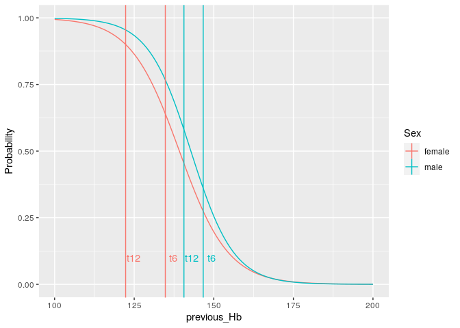
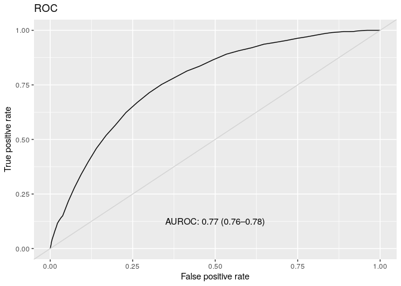
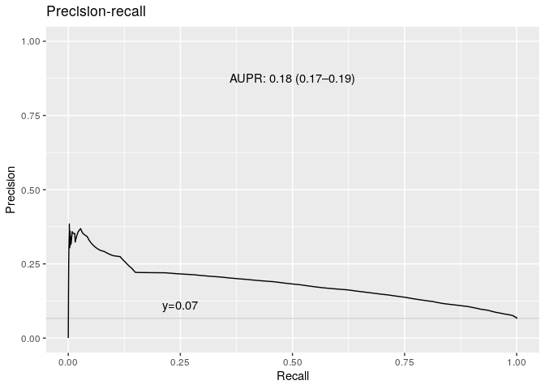
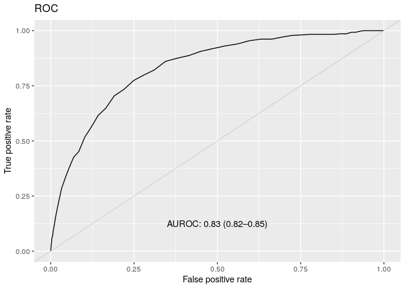
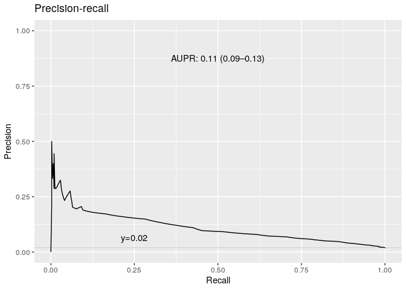

Dummy model for females and males on Progesa data
-------------------------------------------------

Use the preprocessed validate dataset from random forest runs. Dummy
predictor uses -previous\_Hb as score for deferral.

    load("~/FRCBS/interval-sims/rf-train-and-validate-datas.rdata", verbose=TRUE)  # returns train and validate dataframes

    ## Loading objects:
    ##   train
    ##   validate

    load("~/FRCBS/interval-sims/rf-test-data.rdata", verbose=TRUE) # returns test dataframe

    ## Loading objects:
    ##   test

We use [Logistic
function](https://en.wikipedia.org/wiki/Logistic_function) to map
previous\_Hb values to the probability range \[0, 1\].

    logistic <- function(x, k=1, x0=0) 1 / (1 + exp(-k*(x-x0)))

    score <- function(previous_Hb, Hb_threshold ) {
      logistic(previous_Hb, k=-0.1, x0=Hb_threshold)
    }

    make_threshold_conversion_data_frame <- function(Hb_threshold, k) {
      hb <- seq(110, 160, by=2)
      df <- tibble(Hb=hb, 
                   Probability = logistic(hb, k=k, x0=Hb_threshold))
      return(df)
    }

    dummy_predictor <- function(df, Hb_threshold=NULL) { # fake logistic regression
      if (is.null(Hb_threshold)) {    # use -previous_Hb as score
        result <- tibble(Deferred = -df$previous_Hb,
                         obs = df$Hb_deferral)
      } else {                        # use logistic function of previous_Hb as score
        result <- tibble(Deferred = score(df$previous_Hb, Hb_threshold), 
                         obs = df$Hb_deferral)
        
      }
      return(result)
    }

    logistic_regression <- function(train) {
      glm.fit <- glm(Hb_deferral ~ previous_Hb,
                   data = train,
                   family = binomial)
      return(glm.fit)  
    }

    dummy_predictor2 <- function(train, validate) {  # real logistic regression
      glm.fit <- logistic_regression(train)
      print(glm.fit)
      
      glm.probs <- predict(glm.fit,
                          newdata = validate,
                          type = "response")
      
      result <- tibble(Deferred = glm.probs, 
                       obs = validate$Hb_deferral)

      return(list(result=result, fit=glm.fit))  
    }

    df1 <- make_threshold_conversion_data_frame(125, -1) 
    df2 <- make_threshold_conversion_data_frame(125, -0.1)
    df <- bind_rows(`k=-1`=df1, `k=-0.1`= df2, .id="k")
    df %>% ggplot(aes(x=Hb, y=Probability, color=k)) + geom_point() + scale_y_continuous(breaks=seq(0, 1, by=0.1)) + labs(colour="Logistic function parameter") + ggtitle("Female")

    df1 <- make_threshold_conversion_data_frame(135, -1) 
    df2 <- make_threshold_conversion_data_frame(135, -0.1)
    df <- bind_rows(`k=-1`=df1, `k=-0.1`= df2, .id="k")
    df %>% ggplot(aes(x=Hb, y=Probability, color=k)) + geom_point() + scale_y_continuous(breaks=seq(0, 1, by=0.1)) + labs(colour="Logistic function parameter") + ggtitle("Male")

    train_female <- train %>% filter(gender=="Women")
    train_male <- train %>% filter(gender=="Men")
    validate_female <- validate %>% filter(gender=="Women")
    validate_male <- validate %>% filter(gender=="Men")
    test_female <- test %>% filter(gender=="Women")
    test_male <- test %>% filter(gender=="Men")

    use_logistic_regression=TRUE
    if (use_logistic_regression) {
      res <- dummy_predictor2(train_female, test_female)
      prediction_female <- res$result
      fit_female <- res$fit
      
      res <- dummy_predictor2(train_male, test_male)
      prediction_male <- res$result
      fit_male <- res$fit
    } else {
      prediction_female <- dummy_predictor(validate_female, 125)  # or would mean Hb be better centering point than deferral threshold
      prediction_male <- dummy_predictor(validate_male, 135)
    }

    ## 
    ## Call:  glm(formula = Hb_deferral ~ previous_Hb, family = binomial, data = train)
    ## 
    ## Coefficients:
    ## (Intercept)  previous_Hb  
    ##     18.1238      -0.1302  
    ## 
    ## Degrees of Freedom: 34272 Total (i.e. Null);  34271 Residual
    ## Null Deviance:       46380 
    ## Residual Deviance: 37510     AIC: 37510
    ## 
    ## Call:  glm(formula = Hb_deferral ~ previous_Hb, family = binomial, data = train)
    ## 
    ## Coefficients:
    ## (Intercept)  previous_Hb  
    ##     21.2159      -0.1486  
    ## 
    ## Degrees of Freedom: 14905 Total (i.e. Null);  14904 Residual
    ## Null Deviance:       17090 
    ## Residual Deviance: 12610     AIC: 12610

    head(prediction_female)

    ## # A tibble: 6 x 2
    ##   Deferred obs     
    ##      <dbl> <fct>   
    ## 1    0.830 Accepted
    ## 2    0.197 Accepted
    ## 3    0.691 Accepted
    ## 4    0.571 Accepted
    ## 5    0.379 Accepted
    ## 6    0.292 Accepted

    head(prediction_male)

    ## # A tibble: 6 x 2
    ##   Deferred obs     
    ##      <dbl> <fct>   
    ## 1  0.0129  Accepted
    ## 2  0.123   Accepted
    ## 3  0.108   Accepted
    ## 4  0.00219 Accepted
    ## 5  0.0356  Accepted
    ## 6  0.0411  Accepted

    fit_male

    ## 
    ## Call:  glm(formula = Hb_deferral ~ previous_Hb, family = binomial, data = train)
    ## 
    ## Coefficients:
    ## (Intercept)  previous_Hb  
    ##     21.2159      -0.1486  
    ## 
    ## Degrees of Freedom: 14905 Total (i.e. Null);  14904 Residual
    ## Null Deviance:       17090 
    ## Residual Deviance: 12610     AIC: 12610

    fit_female

    ## 
    ## Call:  glm(formula = Hb_deferral ~ previous_Hb, family = binomial, data = train)
    ## 
    ## Coefficients:
    ## (Intercept)  previous_Hb  
    ##     18.1238      -0.1302  
    ## 
    ## Degrees of Freedom: 34272 Total (i.e. Null);  34271 Residual
    ## Null Deviance:       46380 
    ## Residual Deviance: 37510     AIC: 37510

    if (FALSE) {
      save(prediction_female, file="~/FRCBS/interval-sims/progesa-validate-female-dummy2.rdata")
      save(prediction_male, file="~/FRCBS/interval-sims/progesa-validate-male-dummy2.rdata")
    }

    dummy_result <- suppressMessages(process_all_data(dummy2_ids, replicates=100))

    df <- dummy_result %>% 
      pivot_wider(names_from=c("variable", "type"), values_from=value, names_glue="{variable} {type}")
    names(df) <- str_remove(names(df), " value$")
    df <- df %>%
      select("Id", "F1", "F1 low", "F1 high", "threshold6", "threshold12", "E6", "E6 low", "E6 high", "E12", "E12 low", "E12 high")

    kable(df)

<table style="width:100%;">
<colgroup>
<col style="width: 15%" />
<col style="width: 7%" />
<col style="width: 7%" />
<col style="width: 7%" />
<col style="width: 7%" />
<col style="width: 8%" />
<col style="width: 7%" />
<col style="width: 7%" />
<col style="width: 7%" />
<col style="width: 7%" />
<col style="width: 7%" />
<col style="width: 7%" />
</colgroup>
<thead>
<tr class="header">
<th style="text-align: left;">Id</th>
<th style="text-align: right;">F1</th>
<th style="text-align: right;">F1 low</th>
<th style="text-align: right;">F1 high</th>
<th style="text-align: right;">threshold6</th>
<th style="text-align: right;">threshold12</th>
<th style="text-align: right;">E6</th>
<th style="text-align: right;">E6 low</th>
<th style="text-align: right;">E6 high</th>
<th style="text-align: right;">E12</th>
<th style="text-align: right;">E12 low</th>
<th style="text-align: right;">E12 high</th>
</tr>
</thead>
<tbody>
<tr class="odd">
<td style="text-align: left;">progesa-male-dummy</td>
<td style="text-align: right;">0.1560232</td>
<td style="text-align: right;">0.1395105</td>
<td style="text-align: right;">0.1751901</td>
<td style="text-align: right;">0.36</td>
<td style="text-align: right;">0.58</td>
<td style="text-align: right;">-0.8421943</td>
<td style="text-align: right;">-0.9181796</td>
<td style="text-align: right;">-0.7638341</td>
<td style="text-align: right;">-0.1899578</td>
<td style="text-align: right;">-0.2739376</td>
<td style="text-align: right;">-0.1097577</td>
</tr>
<tr class="even">
<td style="text-align: left;">progesa-female-dummy</td>
<td style="text-align: right;">0.1971154</td>
<td style="text-align: right;">0.1897919</td>
<td style="text-align: right;">0.2042999</td>
<td style="text-align: right;">0.64</td>
<td style="text-align: right;">0.90</td>
<td style="text-align: right;">-0.6045015</td>
<td style="text-align: right;">-0.6423967</td>
<td style="text-align: right;">-0.5639575</td>
<td style="text-align: right;">0.1246521</td>
<td style="text-align: right;">0.0959470</td>
<td style="text-align: right;">0.1567972</td>
</tr>
</tbody>
</table>

    data <- tibble(previous_Hb = seq(100, 200))
    data[["male"]] <- predict(fit_male, newdata=data, type="response")
    data[["female"]] <- predict(fit_female, newdata=data, type="response")
    data2 <- data %>% pivot_longer(cols=c(male, female), names_to="Sex", values_to="Probability")
    #data2

    mt <- df %>% filter(Id=="progesa-male-dummy") %>% select(threshold6, threshold12) %>% as.numeric()   # male thresholds
    ft <- df %>% filter(Id=="progesa-female-dummy") %>% select(threshold6, threshold12) %>% as.numeric() # female thresholds
    mhb <- approx(x = data$male,   y = data$previous_Hb, xout=mt)$y                                          # corresponding male hemoglobins
    fhb <- approx(x = data$female, y = data$previous_Hb, xout=ft)$y                                          # corresponding female hemoglobins
    threshold_data <- tibble(previous_Hb = c(mhb, fhb), Probability=c(mt, ft), text=c("t6", "t12", "t6", "t12"), Sex=c("male", "male", "female", "female"))
    kable(threshold_data)

<table>
<thead>
<tr class="header">
<th style="text-align: right;">previous_Hb</th>
<th style="text-align: right;">Probability</th>
<th style="text-align: left;">text</th>
<th style="text-align: left;">Sex</th>
</tr>
</thead>
<tbody>
<tr class="odd">
<td style="text-align: right;">146.6767</td>
<td style="text-align: right;">0.36</td>
<td style="text-align: left;">t6</td>
<td style="text-align: left;">male</td>
</tr>
<tr class="even">
<td style="text-align: right;">140.6242</td>
<td style="text-align: right;">0.58</td>
<td style="text-align: left;">t12</td>
<td style="text-align: left;">male</td>
</tr>
<tr class="odd">
<td style="text-align: right;">134.7695</td>
<td style="text-align: right;">0.64</td>
<td style="text-align: left;">t6</td>
<td style="text-align: left;">female</td>
</tr>
<tr class="even">
<td style="text-align: right;">122.3057</td>
<td style="text-align: right;">0.90</td>
<td style="text-align: left;">t12</td>
<td style="text-align: left;">female</td>
</tr>
</tbody>
</table>

    g <- data2 %>% ggplot(aes(x=previous_Hb, y=Probability, color=Sex)) + 
      geom_line() +
      geom_vline(data=threshold_data, mapping=aes(xintercept=previous_Hb, colour=Sex)) +
      geom_text(data=threshold_data, mapping=aes(x=previous_Hb, label=text), y=0.1, show.legend=FALSE, nudge_x=2.5)
    g

    roc_female <- roc_wrapper(prediction_female)

    ## Setting levels: control = 0, case = 1

    ## Setting direction: controls < cases

    pr_female <- pr_wrapper(prediction_female)

    roc_male <- roc_wrapper(prediction_male)

    ## Setting levels: control = 0, case = 1

    ## Setting direction: controls < cases

    pr_male <- pr_wrapper(prediction_male)

    roc_female

    ## $roc_plot

    ## 
    ## $roc
    ## 
    ## Call:
    ## roc.default(response = labels, predictor = scores, auc = TRUE,     ci = TRUE, plot = FALSE, legacy.axes = TRUE, xlab = "False Positive Rate",     ylab = "True Positive Rate", conf.level = 0.95, boot.stratified = TRUE,     boot.n = boot.n, main = "Receiver operating characteric",     max.auc.polygon = TRUE, print.auc = TRUE)
    ## 
    ## Data: scores in 29894 controls (labels 0) < 2134 cases (labels 1).
    ## Area under the curve: 0.7696
    ## 95% CI: 0.76-0.7791 (DeLong)
    ## 
    ## $roc_auc
    ## Area under the curve: 0.7696

    pr_female$pr_plot

    roc_male

    ## $roc_plot

    ## 
    ## $roc
    ## 
    ## Call:
    ## roc.default(response = labels, predictor = scores, auc = TRUE,     ci = TRUE, plot = FALSE, legacy.axes = TRUE, xlab = "False Positive Rate",     ylab = "True Positive Rate", conf.level = 0.95, boot.stratified = TRUE,     boot.n = boot.n, main = "Receiver operating characteric",     max.auc.polygon = TRUE, print.auc = TRUE)
    ## 
    ## Data: scores in 20813 controls (labels 0) < 416 cases (labels 1).
    ## Area under the curve: 0.8339
    ## 95% CI: 0.8152-0.8526 (DeLong)
    ## 
    ## $roc_auc
    ## Area under the curve: 0.8339

    pr_male$pr_plot

