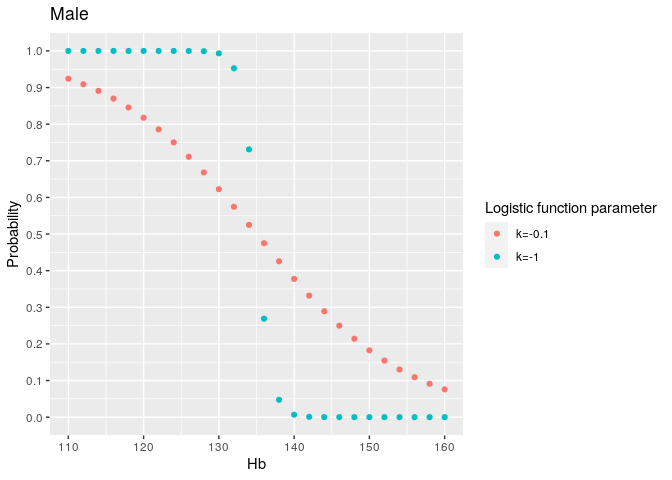

Dummy model for females and males on Progesa data
-------------------------------------------------

Use the preprocessed validate dataset from random forest runs. Dummy
predictor uses -previous\_Hb as score for deferral.

    load("~/FRCBS/interval-sims/rf-train-and-validate-datas.rdata", verbose=TRUE)

    ## Loading objects:
    ##   train
    ##   validate

We use [Logistic
function](https://en.wikipedia.org/wiki/Logistic_function) to map
previous\_Hb values to the probability range \[0, 1\].

    logistic <- function(x, k=1, x0=0) 1 / (1 + exp(-k*(x-x0)))

    score <- function(previous_Hb, Hb_threshold ) {
      logistic(previous_Hb, k=-0.1, x0=Hb_threshold)
    }

    make_threshold_conversion_data_frame <- function(Hb_threshold, k) {
      hb <- seq(110, 160, by=2)
      df <- tibble(Hb=hb, 
                   Probability = logistic(hb, k=k, x0=Hb_threshold))
      return(df)
    }

    dummy_predictor <- function(df, Hb_threshold=NULL) {
      if (is.null(Hb_threshold)) {    # use -previous_Hb as score
        result <- tibble(Deferred = -df$previous_Hb,
                         obs = df$Hb_deferral)
      } else {                        # use logistic function of previous_Hb as score
        result <- tibble(Deferred = score(df$previous_Hb, Hb_threshold), 
                         obs = df$Hb_deferral)
        
      }
      return(result)
    }

    # get_metrics <- function(df, previous_Hb_threshold) {
    #   df <- df %>% mutate(predicted_Hb_deferral=factor(ifelse(previous_Hb < previous_Hb_threshold, "Deferred", "Accepted"), levels=c("Accepted", "Deferred")))
    #   
    #   cm <- confusionMatrix(reference = df$Hb_deferral, data = df$predicted_Hb_deferral, positive = "Deferred", mode = "everything")
    #   f1 <- cm$byClass["F1"]
    #          #Sensitivity  = TPR
    #   TPR <- cm$byClass['Sensitivity']
    #   FPR <- 1 - cm$byClass['Specificity']
    #   temp <- get_cost(TPR, FPR, TPR, FPR, p = parameters) # The parameters are from file economic_effect_functions.R
    #   E6  <- temp$E6
    #   E12 <- temp$E12
    #   return(tibble(previous_Hb_threshold=previous_Hb_threshold, f1=f1, E6=E6, E12=E12))
    # }
    # 
    # optimize_threshold <- function(df) {
    #   thresholds <- seq(120, 150, by=2)
    #   result <- map_dfr(thresholds, function(t) get_metrics(df, t))
    #   
    #   threshold <- result %>%
    #     slice_max(f1) %>%
    #     pull(previous_Hb_threshold)
    #   return(list(threshold=threshold, result=result))
    # }

    df1 <- make_threshold_conversion_data_frame(125, -1) 
    df2 <- make_threshold_conversion_data_frame(125, -0.1)
    df <- bind_rows(`k=-1`=df1, `k=-0.1`= df2, .id="k")
    df %>% ggplot(aes(x=Hb, y=Probability, color=k)) + geom_point() + scale_y_continuous(breaks=seq(0, 1, by=0.1)) + labs(colour="Logistic function parameter") + ggtitle("Female")

    df1 <- make_threshold_conversion_data_frame(135, -1) 
    df2 <- make_threshold_conversion_data_frame(135, -0.1)
    df <- bind_rows(`k=-1`=df1, `k=-0.1`= df2, .id="k")
    df %>% ggplot(aes(x=Hb, y=Probability, color=k)) + geom_point() + scale_y_continuous(breaks=seq(0, 1, by=0.1)) + labs(colour="Logistic function parameter") + ggtitle("Male")

    train_female <- train %>% filter(gender=="Women")
    train_male <- train %>% filter(gender=="Men")
    validate_female <- validate %>% filter(gender=="Women")
    validate_male <- validate %>% filter(gender=="Men")

    # res_female <- optimize_threshold(train_female)
    # res_male <- optimize_threshold(train_male)

Optimized thresholds on previous Hb for females and males

    # female_previous_Hb_threshold <- res_female$threshold
    # male_previous_Hb_threshold <- res_male$threshold
    # female_previous_Hb_threshold
    # male_previous_Hb_threshold

    # res_female$result
    # res_male$result

Final result on validate data

    # f1_female <- get_f1(validate_female, female_previous_Hb_threshold)
    # f1_female

    # f1_male <- get_f1(validate_male, male_previous_Hb_threshold)
    # f1_male

    prediction_female <- dummy_predictor(validate_female, 125)  # or would mean Hb be better centering point than deferral threshold
    prediction_male <- dummy_predictor(validate_male, 135)

    head(prediction_female)

    ## # A tibble: 6 x 2
    ##   Deferred obs     
    ##      <dbl> <fct>   
    ## 1   0.475  Accepted
    ## 2   0.401  Accepted
    ## 3   0.0911 Accepted
    ## 4   0.0998 Accepted
    ## 5   0.198  Accepted
    ## 6   0.109  Accepted

    head(prediction_male)

    ## # A tibble: 6 x 2
    ##   Deferred obs     
    ##      <dbl> <fct>   
    ## 1   0.168  Accepted
    ## 2   0.0323 Accepted
    ## 3   0.0474 Accepted
    ## 4   0.0431 Accepted
    ## 5   0.0832 Accepted
    ## 6   0.130  Accepted

    save(prediction_female, file="~/FRCBS/interval-sims/progesa-validate-female-dummy.rdata")
    save(prediction_male, file="~/FRCBS/interval-sims/progesa-validate-male-dummy.rdata")

    dummy_result <- process_all_data(dummy2_ids)

    dummy_result

    ## # A tibble: 2 x 12
    ##   Id       F1 `F1 low` `F1 high` threshold6 threshold12     E6 `E6 low`
    ##   <chr> <dbl>    <dbl>     <dbl>      <dbl>       <dbl>  <dbl>    <dbl>
    ## 1 prog… 0.188    0.149     0.227        0.2         0.4 -0.783   -0.874
    ## 2 prog… 0.232    0.213     0.250        0.3         0.5 -0.588   -0.633
    ## # … with 4 more variables: `E6 high` <dbl>, E12 <dbl>, `E12 low` <dbl>, `E12
    ## #   high` <dbl>

    roc_female <- roc_wrapper(prediction_female)

    ## Setting levels: control = 0, case = 1

    ## Setting direction: controls < cases

    pr_female <- pr_wrapper(prediction_female)

    roc_male <- roc_wrapper(prediction_male)

    ## Setting levels: control = 0, case = 1

    ## Setting direction: controls < cases

    pr_male <- pr_wrapper(prediction_male)

    v <- c(roc_female$roc$ci[c(2,1,3)], pr_female$ci[c(1,2,3)], 
           roc_male$roc$ci[c(2,1,3)], pr_male$ci[c(1,2,3)])
    aucs <- as_tibble(matrix(v, ncol=6, byrow=TRUE))

    ## Warning: The `x` argument of `as_tibble.matrix()` must have unique column names if `.name_repair` is omitted as of tibble 2.0.0.
    ## Using compatibility `.name_repair`.
    ## This warning is displayed once every 8 hours.
    ## Call `lifecycle::last_warnings()` to see where this warning was generated.

    colnames(aucs) <- c("AUROC", "AUROC low", "AUROC high", "AUPR value", "AUPR low", "AUPR high")
    aucs <- aucs %>% 
      mutate(Id=dummy2_ids) %>%
      select(Id, everything())

    aucs

    ## # A tibble: 2 x 7
    ##   Id          AUROC `AUROC low` `AUROC high` `AUPR value` `AUPR low` `AUPR high`
    ##   <chr>       <dbl>       <dbl>        <dbl>        <dbl>      <dbl>       <dbl>
    ## 1 progesa-ma… 0.770       0.760        0.781        0.189     0.176        0.201
    ## 2 progesa-fe… 0.827       0.805        0.849        0.122     0.0905       0.144

    dummy_result <- inner_join(aucs, dummy_result, by="Id")
    dummy_result

    ## # A tibble: 2 x 18
    ##   Id    AUROC `AUROC low` `AUROC high` `AUPR value` `AUPR low` `AUPR high`    F1
    ##   <chr> <dbl>       <dbl>        <dbl>        <dbl>      <dbl>       <dbl> <dbl>
    ## 1 prog… 0.770       0.760        0.781        0.189     0.176        0.201 0.188
    ## 2 prog… 0.827       0.805        0.849        0.122     0.0905       0.144 0.232
    ## # … with 10 more variables: `F1 low` <dbl>, `F1 high` <dbl>, threshold6 <dbl>,
    ## #   threshold12 <dbl>, E6 <dbl>, `E6 low` <dbl>, `E6 high` <dbl>, E12 <dbl>,
    ## #   `E12 low` <dbl>, `E12 high` <dbl>
